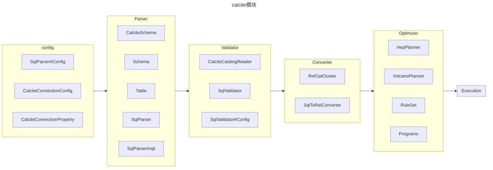
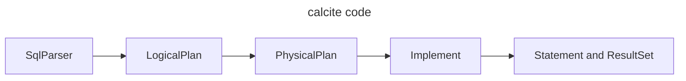
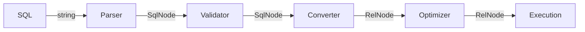
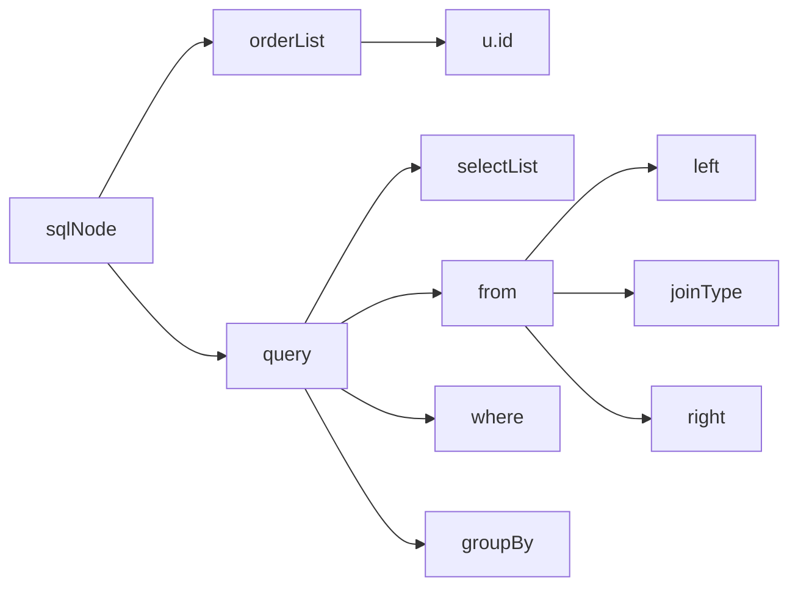

# [Apache Calcite原理与实践](https://liebing.org.cn/collections/calcite/#Apache-Calcite%E5%8E%9F%E7%90%86%E4%B8%8E%E5%AE%9E%E8%B7%B5)

## 引用

[Relational Model in DBMS](https://www.geeksforgeeks.org/relational-model-in-dbms/)

[Introduction of Relational Algebra in DBMS](https://www.geeksforgeeks.org/introduction-of-relational-algebra-in-dbms/)

[FMPP - FreeMarker-based file PreProcessor](https://fmpp.sourceforge.net)

[Apache Calcite Code Reading Part 1](https://medium.com/@masayuki/calcite-code-reading-part-1-4ff7cdc56959)

[Calcite Code Reading Part 2](https://medium.com/@masayuki/apache-calcite-code-reading-part-2-594e8ca17acf)

[SQL is parsed by SqlParser and convert to SqlNode](https://github.com/apache/calcite/blob/73023148e7f37d494f6caf92b01b090f6dde13cd/core/src/main/java/org/apache/calcite/prepare/CalcitePrepareImpl.java#L612)

[Calcite generates a Logical Plan from SqlNodes](https://github.com/apache/calcite/blob/73023148e7f37d494f6caf92b01b090f6dde13cd/core/src/main/java/org/apache/calcite/prepare/Prepare.java#L264)

[Calcite generates a Physical plan based on the Logical Plan with planners at optimize phase](https://github.com/apache/calcite/blob/73023148e7f37d494f6caf92b01b090f6dde13cd/core/src/main/java/org/apache/calcite/prepare/Prepare.java#L320)

After generated the Physical Plan, [the RelNodes that consist of it process the records](https://github.com/apache/calcite/blob/73023148e7f37d494f6caf92b01b090f6dde13cd/core/src/main/java/org/apache/calcite/prepare/Prepare.java#L332)

[Apache Calcite 优化器详解（二）](https://matt33.com/2019/03/17/apache-calcite-planner/)

[SQL 查询优化原理与 Volcano Optimizer 介绍](https://io-meter.com/2018/11/01/sql-query-optimization-volcano/)

## portrayal

### 一次完整的calcite请求可能涉及的类




### VolcanoPlanner 优化器的执行流程

接下来就是如何筛选规则了，当把语法树转成RelNode Tree后是没有必要把前面注册的90条优化规则都用上的，所以需要有个筛选的过程，因为每种规则是有应用范围的，按RelNode Tree的不同节点类型就可以筛选出实际需要用到的优化规则了。这一步说起来很简单，但在calcite的代码实现里是相当复杂的，也是非常关键的一步，是从调用`VolcanoPlanner.setRoot`方法开始间接触发的，如果只是静态的看代码不跑起来跟踪调试多半摸不清它的核心流程的。筛选出来的优化规则会封装成`VolcanoRuleMatch`，然后扔到`RuleQueue`里，而这个RuleQueue正是接下来执行动态规划算法要用到的核心类。筛选规则这一步的代码实现很晦涩。

第三步才到VolcanoPlanner.findBestExp，本质上就是一个动态规划算法的实现，但是最值得关注的还是怎么用第二步筛选出来的规则对RelNode Tree进行变换，变换后的形式还是一棵RelNode Tree，最常见的是把LogicalXXX开头的RelNode子类换成了EnumerableXXX或BindableXXX，总而言之，看看具体优化规则的实现就对了，都是繁琐的体力活。

## Relational Model in DBMS

### What is the Relational Model? 

The relational model represents how data is stored in Relational Databases. **A relational database consists of a collection of tables**, each of which is assigned a unique name. Consider a relation STUDENT with attributes ROLL_NO, NAME, ADDRESS, PHONE, and AGE shown in the table. 

| ROLL_NO |  NAME  | ADDRESS |   PHONE    | AGE  |
| :-----: | :----: | :-----: | :--------: | :--: |
|    1    |  RAM   |  DELHI  | 9455123451 |  18  |
|    2    | RAMESH | GURGAON | 9652431543 |  18  |
|    3    | SUJIT  | ROHTAK  | 9156253131 |  20  |
|    4    | SURESH |  DELHI  |            |  18  |

### Important Terminologies

- ***\*Attribute:\**** Attributes are the properties that define an entity. e.g.; ***\*ROLL_NO\****, ***\*NAME, ADDRESS\****
- ***\*Relation Schema:\**** A relation schema defines the structure of the relation and represents the name of the relation with its attributes. e.g.; STUDENT (ROLL_NO, NAME, ADDRESS, PHONE, and AGE) is the relation schema for STUDENT. If a schema has more than 1 relation, it is called Relational Schema.
- ***\*Tuple:\**** Each row in the relation is known as a tuple. 
- ***\*Relation Instance:\**** The set of tuples of a relation at a particular instance of time is called a relation instance. 
- ***\*Degree:\**** The number of attributes in the relation is known as the degree of the relation. The ***\*STUDENT\**** relation defined above has degree 5.
- **\*Cardinality\***: The number of tuples in a relation is known as cardinality. The STUDENT relation defined above has cardinality 4.
- ***\*Column:\**** The column represents the set of values for a particular attribute. 

## Introduction of Relational Algebra in DBMS

## Apache Calcite Code Reading Part1



1. [Your SQL is parsed by SqlParser and convert to SqlNode](https://github.com/apache/calcite/blob/73023148e7f37d494f6caf92b01b090f6dde13cd/core/src/main/java/org/apache/calcite/prepare/CalcitePrepareImpl.java#L612)
2. [Calcite generates a Logical Plan from SqlNodes](https://github.com/apache/calcite/blob/73023148e7f37d494f6caf92b01b090f6dde13cd/core/src/main/java/org/apache/calcite/prepare/Prepare.java#L264)
3. [Calcite generates a Physical plan based on the Logical Plan with planners at optimize phase](https://github.com/apache/calcite/blob/73023148e7f37d494f6caf92b01b090f6dde13cd/core/src/main/java/org/apache/calcite/prepare/Prepare.java#L320)
4. After generated the Physical Plan, [the RelNodes that consist of it process the records](https://github.com/apache/calcite/blob/73023148e7f37d494f6caf92b01b090f6dde13cd/core/src/main/java/org/apache/calcite/prepare/Prepare.java#L332). `EnumerableFilter` filters them with specified conditions and `EnumerableProject` extract specified fields only. These classes of Enumerable Adapter generate a Bindable class on demand in order to processing the records. In this case, finally, `EnumerableCalc`[ do that](https://github.com/apache/calcite/blob/73023148e7f37d494f6caf92b01b090f6dde13cd/core/src/main/java/org/apache/calcite/adapter/enumerable/EnumerableCalc.java#L110).
5. [Calcite instantiates the previously created class as Bindable](https://github.com/apache/calcite/blob/73023148e7f37d494f6caf92b01b090f6dde13cd/core/src/main/java/org/apache/calcite/adapter/enumerable/EnumerableInterpretable.java#L162). Then [setting it to ](https://github.com/apache/calcite/blob/73023148e7f37d494f6caf92b01b090f6dde13cd/core/src/main/java/org/apache/calcite/prepare/CalcitePrepareImpl.java#L703)`CalciteSignature` and [passing to AvaticaResultSet](https://github.com/apache/calcite-avatica/blob/d52c2036224911d93fe3185f521768037e62a437/core/src/main/java/org/apache/calcite/avatica/AvaticaConnection.java#L660).

## [Calcite Code Reading Part 2](https://medium.com/@masayuki/apache-calcite-code-reading-part-2-594e8ca17acf)

## [Apache Calcite整体架构及处理流程](https://liebing.org.cn/apache-calcite-overview.html)

### Calcite整体架构

1. JDBC接口
2. SQL Parser和SQL Validator：解析SQL到 `SqlNode`
3. Query Optimizer：基于 RBO 和 CBO 的优化器，一般转换后成为 `RelNod`，RelNode 可能从 SqlNode 转化过来，或者由 `Expressions Builder` 构建；
4. Enumerator执行计划： Calcite提供了一种将优化后的`RelNode`树生成为Enumerator执行计划的方法, Enumerator执行计划基于Linq4j实现, 这部分并未在图中画出. 由于多数系统有自己的执行接口, 因此Calcite的这部分组件在成熟的系统中较少使用. Calcite的一些[Adapter](https://calcite.apache.org/docs/adapter.html)使用了Enumerator执行计划.

### Calcite处理流程



> `Converter` A relational expression implements the interface `Converter` to indicate that it converts a physical attribute, or trait, of a relational expression from one value to another.

从图中可以看出, Calcite的处理流程主要分为5个阶段:

1. Parser用于解析SQL, 将输入的SQL字符串转化为抽象语法树(AST), Calcite中用`SqlNode`树表示，**一般基于javacc生成**.
2. Validator根据元数据信息对`SqlNode`树进行验证, 其输出仍是`SqlNode`树.
3. Converter将`SqlNode`树转化为关系代数, 以方便进一步优化, Calcite中使用`RelNode`树表示关系代数.
4. Optimizer对输入的关系代数进行优化, 输出优化后的`RelNode`树.
5. Execute阶段会根据优化后的`RelNode`生成执行计划, 在Calcite中内置了一种基于Enumerator的执行计划生成方法.

> 每个模块在calcite中涉及的类如下所示：


#### Parser

```sql
SELECT u.id, name, age, sum(price)
FROM users AS u join orders AS o ON u.id = o.user_id
WHERE age >= 20 AND age <= 30
GROUP BY u.id, name, age
ORDER BY u.id
```

对于以上SQL，我们可以直接使用calcite解析，calcite基于 `parser.jj` 进行词法分析。

```java
    @Test
    void testQuery() throws SqlParseException {
        SqlParser sqlParser = SqlParser.create("SELECT u.id, name, age, sum(price)\n"
                                               + "FROM users AS u join orders AS o ON u.id = o.user_id\n"
                                               + "WHERE age >= 20 AND age <= 30\n"
                                               + "GROUP BY u.id, name, age\n"
                                               + "ORDER BY u.id", SqlParser.Config.DEFAULT);

        SqlNode sqlNode = sqlParser.parseStmt();
    }
```

生成的AST大概如图所示：



#### 整体流程

```java
    @BeforeAll
    public static void setup() {
        // 初始化metadata
        initTable();
        initSchema();

        // 初始化calcite内部信息
        // planner 和 optimizer 会使用CatalogReader读取元数据信息
        initCalciteConnectionConfig();
        initCalciteSchema();
        initCatalogReader();

        // 初始化 validator, planner, converter, optimizer
        initSqlValidator();
        initPlanner();
        initConverter();
        initOptimizer();
    }
```

#### Validator

```java
    private static void initCatalogReader() {
        RelDataTypeFactory typeFactory = new JavaTypeFactoryImpl();
        // create catalog reader, needed by SqlValidator
        catalogReader = new CalciteCatalogReader(
                rootSchema,
                Collections.singletonList(schema.getSchemaName()),
                typeFactory,
                calciteConnectionConfig);

    }

    private static void initSqlValidator() {
        // create SqlValidator
        SqlValidator.Config validatorConfig = SqlValidator.Config.DEFAULT
                .withLenientOperatorLookup(calciteConnectionConfig.lenientOperatorLookup())
                .withSqlConformance(calciteConnectionConfig.conformance())
                .withDefaultNullCollation(calciteConnectionConfig.defaultNullCollation())
                .withIdentifierExpansion(true);
        validator = SqlValidatorUtil.newValidator(
                SqlStdOperatorTable.instance(), catalogReader, catalogReader.getTypeFactory(), validatorConfig);
    }
```

#### planner

```java
    private static void initPlanner() {
        // 创建VolcanoPlanner, VolcanoPlanner在后面的优化中还需要用到
        planner = new VolcanoPlanner(RelOptCostImpl.FACTORY, Contexts.of(calciteConnectionConfig));
        planner.addRelTraitDef(ConventionTraitDef.INSTANCE);
    }
```

#### Converter

```java
    private static void initConverter() {
        // 创建SqlToRelConverter
        RelOptCluster cluster = RelOptCluster.create(planner, new RexBuilder(catalogReader.getTypeFactory()));
        SqlToRelConverter.Config converterConfig = SqlToRelConverter.config()
                                                                    .withTrimUnusedFields(true)
                                                                    .withExpand(false);
        converter = new SqlToRelConverter(
                null,
                validator,
                catalogReader,
                cluster,
                StandardConvertletTable.INSTANCE,
                converterConfig);
    }
```

#### optimizer

```java
    private static void initOptimizer() {
        // 优化规则
        RuleSet rules = RuleSets.ofList(
                CoreRules.FILTER_TO_CALC,
                CoreRules.PROJECT_TO_CALC,
                CoreRules.FILTER_CALC_MERGE,
                CoreRules.PROJECT_CALC_MERGE,
                CoreRules.FILTER_INTO_JOIN,        // 过滤谓词下推到Join之前
                EnumerableRules.ENUMERABLE_TABLE_SCAN_RULE,
                EnumerableRules.ENUMERABLE_PROJECT_TO_CALC_RULE,
                EnumerableRules.ENUMERABLE_FILTER_TO_CALC_RULE,
                EnumerableRules.ENUMERABLE_JOIN_RULE,
                EnumerableRules.ENUMERABLE_SORT_RULE,
                EnumerableRules.ENUMERABLE_CALC_RULE,
                EnumerableRules.ENUMERABLE_AGGREGATE_RULE);
        program = Programs.of(RuleSets.ofList(rules));
    }
```


