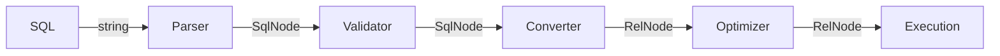
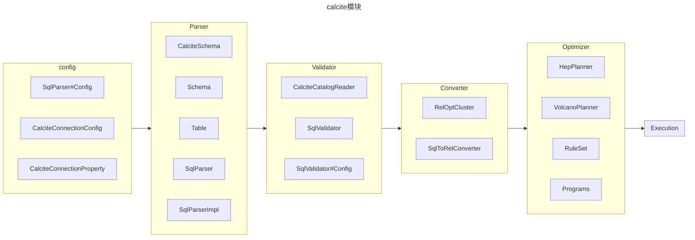
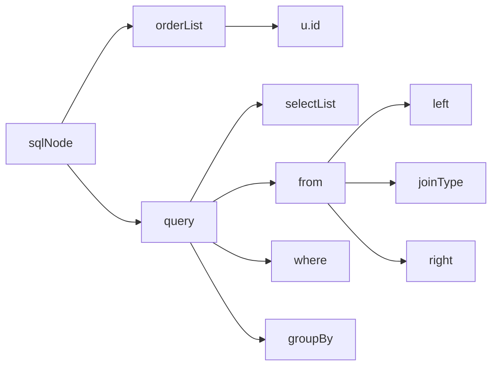

# [Apache Calcite原理与实践](https://liebing.org.cn/collections/calcite/#Apache-Calcite%E5%8E%9F%E7%90%86%E4%B8%8E%E5%AE%9E%E8%B7%B5)

## [Apache Calcite整体架构及处理流程](https://liebing.org.cn/apache-calcite-overview.html)

### Calcite整体架构

1. JDBC接口
2. SQL Parser和SQL Validator：解析SQL到 `SqlNode`
3. Query Optimizer：基于 RBO 和 CBO 的优化器，一般转换后成为 `RelNod`，RelNode 可能从 SqlNode 转化过来，或者由 `Expressions Builder` 构建；
4. Enumerator执行计划： Calcite提供了一种将优化后的`RelNode`树生成为Enumerator执行计划的方法, Enumerator执行计划基于Linq4j实现, 这部分并未在图中画出. 由于多数系统有自己的执行接口, 因此Calcite的这部分组件在成熟的系统中较少使用. Calcite的一些[Adapter](https://calcite.apache.org/docs/adapter.html)使用了Enumerator执行计划.

### Calcite处理流程



> `Converter` A relational expression implements the interface `Converter` to indicate that it converts a physical attribute, or trait, of a relational expression from one value to another.

从图中可以看出, Calcite的处理流程主要分为5个阶段:

1. Parser用于解析SQL, 将输入的SQL字符串转化为抽象语法树(AST), Calcite中用`SqlNode`树表示，**一般基于javacc生成**.
2. Validator根据元数据信息对`SqlNode`树进行验证, 其输出仍是`SqlNode`树.
3. Converter将`SqlNode`树转化为关系代数, 以方便进一步优化, Calcite中使用`RelNode`树表示关系代数.
4. Optimizer对输入的关系代数进行优化, 输出优化后的`RelNode`树.
5. Execute阶段会根据优化后的`RelNode`生成执行计划, 在Calcite中内置了一种基于Enumerator的执行计划生成方法.

> 每个模块在calcite中涉及的类如下所示：




#### Parser

```sql
SELECT u.id, name, age, sum(price)
FROM users AS u join orders AS o ON u.id = o.user_id
WHERE age >= 20 AND age <= 30
GROUP BY u.id, name, age
ORDER BY u.id
```

对于以上SQL，我们可以直接使用calcite解析，calcite基于 `parser.jj` 进行词法分析。

```java
    @Test
    void testQuery() throws SqlParseException {
        SqlParser sqlParser = SqlParser.create("SELECT u.id, name, age, sum(price)\n"
                                               + "FROM users AS u join orders AS o ON u.id = o.user_id\n"
                                               + "WHERE age >= 20 AND age <= 30\n"
                                               + "GROUP BY u.id, name, age\n"
                                               + "ORDER BY u.id", SqlParser.Config.DEFAULT);

        SqlNode sqlNode = sqlParser.parseStmt();
    }
```

生成的AST大概如图所示：



#### 整体流程

```java
    @BeforeAll
    public static void setup() {
        // 初始化metadata
        initTable();
        initSchema();

        // 初始化calcite内部信息
        // planner 和 optimizer 会使用CatalogReader读取元数据信息
        initCalciteConnectionConfig();
        initCalciteSchema();
        initCatalogReader();

        // 初始化 validator, planner, converter, optimizer
        initSqlValidator();
        initPlanner();
        initConverter();
        initOptimizer();
    }
```

#### Validator

```java
    private static void initCatalogReader() {
        RelDataTypeFactory typeFactory = new JavaTypeFactoryImpl();
        // create catalog reader, needed by SqlValidator
        catalogReader = new CalciteCatalogReader(
                rootSchema,
                Collections.singletonList(schema.getSchemaName()),
                typeFactory,
                calciteConnectionConfig);

    }

    private static void initSqlValidator() {
        // create SqlValidator
        SqlValidator.Config validatorConfig = SqlValidator.Config.DEFAULT
                .withLenientOperatorLookup(calciteConnectionConfig.lenientOperatorLookup())
                .withSqlConformance(calciteConnectionConfig.conformance())
                .withDefaultNullCollation(calciteConnectionConfig.defaultNullCollation())
                .withIdentifierExpansion(true);
        validator = SqlValidatorUtil.newValidator(
                SqlStdOperatorTable.instance(), catalogReader, catalogReader.getTypeFactory(), validatorConfig);
    }
```

#### planner

```java
    private static void initPlanner() {
        // 创建VolcanoPlanner, VolcanoPlanner在后面的优化中还需要用到
        planner = new VolcanoPlanner(RelOptCostImpl.FACTORY, Contexts.of(calciteConnectionConfig));
        planner.addRelTraitDef(ConventionTraitDef.INSTANCE);
    }
```

#### Converter

```java
    private static void initConverter() {
        // 创建SqlToRelConverter
        RelOptCluster cluster = RelOptCluster.create(planner, new RexBuilder(catalogReader.getTypeFactory()));
        SqlToRelConverter.Config converterConfig = SqlToRelConverter.config()
                                                                    .withTrimUnusedFields(true)
                                                                    .withExpand(false);
        converter = new SqlToRelConverter(
                null,
                validator,
                catalogReader,
                cluster,
                StandardConvertletTable.INSTANCE,
                converterConfig);
    }
```

#### optimizer

```java
    private static void initOptimizer() {
        // 优化规则
        RuleSet rules = RuleSets.ofList(
                CoreRules.FILTER_TO_CALC,
                CoreRules.PROJECT_TO_CALC,
                CoreRules.FILTER_CALC_MERGE,
                CoreRules.PROJECT_CALC_MERGE,
                CoreRules.FILTER_INTO_JOIN,        // 过滤谓词下推到Join之前
                EnumerableRules.ENUMERABLE_TABLE_SCAN_RULE,
                EnumerableRules.ENUMERABLE_PROJECT_TO_CALC_RULE,
                EnumerableRules.ENUMERABLE_FILTER_TO_CALC_RULE,
                EnumerableRules.ENUMERABLE_JOIN_RULE,
                EnumerableRules.ENUMERABLE_SORT_RULE,
                EnumerableRules.ENUMERABLE_CALC_RULE,
                EnumerableRules.ENUMERABLE_AGGREGATE_RULE);
        program = Programs.of(RuleSets.ofList(rules));
    }
```


