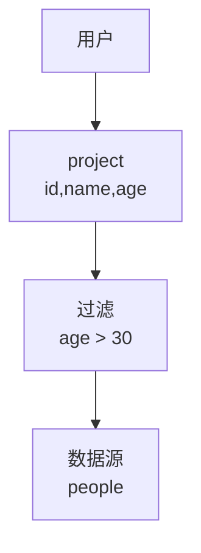

# test-calcite
本仓库是 [Calcite数据管理实战](https://www.epubit.com/bookDetails?id=UBc86c6dbe59b2) 一书的读书笔记。

## QA

### SqlOperator 和 SqlCall 的区别是什么

### 如何使用maven基于JavaCC生成解析类 && 如何将生成的解析类依赖加入到maven项目中

### 如何使用模板引擎来扩展语法文件

## sqlline

### 使用calcite内置的csv作为第一个例子

```bash
# 下载
git clone https://github.com/apache/calcite.git

cd calcite/example/csv

# 编译并进入sqlline
./sqlline

# 连接
!connect jdbc:calcite:model=src/test/resources/model.json admin admin
```

### sqlline的其他用法

```bash
# 查看当前所有连接
!list

# 跳转到0号连接
!go 0
```

### sqline的元数据

> 下面的是 `model.json` 文件
>
> 1. `name` 指定了模型名；
> 2. `type` 指定 `custom` 表示是用户自定义的；
> 3. `factory` 指定的数据模型工厂类的全路径；
> 4. `operand.directory` 指定了目录为 `sales`；

```json
{
  "version": "1.0",
  "defaultSchema": "SALES",
  "schemas": [
    {
      "name": "SALES",
      "type": "custom",
      "factory": "org.apache.calcite.adapter.csv.CsvSchemaFactory",
      "operand": {
        "directory": "sales"
      }
    }
  ]
}

```

### 集成CSV文件开发实例

>要在calcite中使用CSV，首先必须对CSV文件的格式进行定义

#### CsvSchemaFactory

```java
public class CsvSchemaFactory implements SchemaFactory {
  /** Public singleton, per factory contract. */
  public static final CsvSchemaFactory INSTANCE = new CsvSchemaFactory();

  private CsvSchemaFactory() {
  }

  @Override public Schema create(SchemaPlus parentSchema, String name,
      Map<String, Object> operand) {
    // 查找目录
    final String directory = (String) operand.get("directory");
    final File base =
        (File) operand.get(ModelHandler.ExtraOperand.BASE_DIRECTORY.camelName);
    File directoryFile = new File(directory);
    if (base != null && !directoryFile.isAbsolute()) {
      directoryFile = new File(base, directory);
    }

    // 这个参数会指定CSV的表类型，分别是：
    // CsvTranslatableTable 用于描述可翻译的表（Translatable Table）的行为。它定义了翻译表到特定数据库的查询的方法。
    // CsvScannableTable 可扫描的表
    // CsvFilterableTable 用于处理可过滤的 CSV 格式表数据
    String flavorName = (String) operand.get("flavor");
    CsvTable.Flavor flavor;
    if (flavorName == null) {
      flavor = CsvTable.Flavor.SCANNABLE;
    } else {
      flavor = CsvTable.Flavor.valueOf(flavorName.toUpperCase(Locale.ROOT));
    }
    return new CsvSchema(directoryFile, flavor);
  }
}
```

#### CsvSchema

```java
  @Override protected Map<String, Table> getTableMap() {
    if (tableMap == null) {
      tableMap = createTableMap();
    }
    return tableMap;
  }

  private Map<String, Table> createTableMap() {
    // 查找所有.gz, .csv, .json 结尾的文件
    final Source baseSource = Sources.of(directoryFile);
    File[] files = directoryFile.listFiles((dir, name) -> {
      final String nameSansGz = trim(name, ".gz");
      return nameSansGz.endsWith(".csv")
          || nameSansGz.endsWith(".json");
    });
    if (files == null) {
      System.out.println("directory " + directoryFile + " not found");
      files = new File[0];
    }
    // Build a map from table name to table; each file becomes a table.
    final ImmutableMap.Builder<String, Table> builder = ImmutableMap.builder();
    for (File file : files) {
      // 获取source
      Source source = Sources.of(file);
      Source sourceSansGz = source.trim(".gz");

      // 处理json数据源并转换为table
      final Source sourceSansJson = sourceSansGz.trimOrNull(".json");
      if (sourceSansJson != null) {
        final Table table = new JsonScannableTable(source);
        builder.put(sourceSansJson.relative(baseSource).path(), table);
      }

      // 处理csv数据源并转换为table
      final Source sourceSansCsv = sourceSansGz.trimOrNull(".csv");
      if (sourceSansCsv != null) {
        final Table table = createTable(source);
        builder.put(sourceSansCsv.relative(baseSource).path(), table);
      }
    }
    return builder.build();
  }

  /** Creates different sub-type of table based on the "flavor" attribute. */
  private Table createTable(Source source) {
    switch (flavor) {
    case TRANSLATABLE:
      return new CsvTranslatableTable(source, null);
    case SCANNABLE:
      return new CsvScannableTable(source, null);
    case FILTERABLE:
      return new CsvFilterableTable(source, null);
    default:
      throw new AssertionError("Unknown flavor " + this.flavor);
    }
  }
```

## 数据库查询优化技术

### 逻辑查询优化

>优化就是基于关系代数的等价转换。
>
>
>
>谓词下推（predicate pushdown）会把所有的WHERE条件挪动到最接近数据源的位置，这样可以在查询的时候花费最小代价；
>
>
>
>常量折叠：在查询优化器处计算所有能计算的，降低查询引擎负载；
>
>
>
>列裁剪：只查询需要的列，可能需要查询引擎配合；
>
>
>
>条件简化：

#### 谓词下推

```sql
SELECT
	t1.name,
	t2.age,
	t2.class,
	t2.income
FROM
	t1
INNER JOIN
	t2
ON
	t1.id = t2.id
WHERE
	t2.age > 18;
```

> 优化后

```sql
SELECT
	t1.name,
	t3.age,
	t3.class,
	t3.income
FROM
	t1
INNER JOIN
	(
  	SELECT
    	t2.id,
    	t2.age,
	    t2.class,
    	t2.income
    FROM
    	t2
    WHERE
    	t2.age > 18
  ) AS t3
ON
	t1.id = t3.id
```

### 4.4 物理计划优化

相比与逻辑计划优化，物理计划更贴近于计算机的物理层面。距离来说，当我们做逻辑优化的时候，我们不需要考虑计算运行于intel还是amd的CPU，也不需要考虑硬盘使用的是SSD还是普通的机械硬盘诸如此类的问题。


在执行物理计划优化之前，我们必须有一个方法来估算我们的查询代价，这个估算的依据就是我们的代价模型；


传统的单机数据我们主要考虑的是I/O和CPU的开销：

```
cost() = page_num * cpu_time_per_page + cpu_cost
```

而很多新的分布式数据库，我们还需要考虑服务器之间通信的开销。


在更具体的优化中，我们还拆分了 **侧重于数据的逻辑代价**，**侧重于服务器环境的物理执行代价**，**针对算法原子操作的算法代价**。


逻辑代价主要瞄准于数据，一般和统计模块总和使用。主要基于操作的结果集大小等参数来优化；


物理执行代价更加侧重于计算机物理层面的代价，简而言之我们要尽量从速度更快的地方读取数据（例如CPU的缓存优先级高于内存），通过SIMD等方式更加并行的利用CPU，在保证进程不崩溃的情况下提高缓存命中率；在访问硬盘时顺序读写优先于随机读写。


算法代价主要是针对于算法的。


### 优化模型

优化模型主要分为：

1. 启发式模型；
2. 火山模型；
3. 向量模型；

其中启发式模型主要是源于启发式算法，在可接受的代价范围内给出对应组合优化问题的每一个实例一个可行解。有可能性能很好，但是也有可能性能很差，现在使用已经不多了。

火山模型是将整个关系代数中的每一个操作都抽象为一个运算符，将整个SQL的逻辑结构抽象为一个运算符树。**查询操作由根节点发起，通过next接口一步一步向查询引擎发送。数据被自下而上逐级拉起，如同火山喷发因此命名为火山模型。**

```sql
SELECT 
	id,
	name,
	age
FROM
	people
WHERE
	age > 30;
```

以上SQL会被抽象为




火山模型每次调用会调用next节点，从而带来大量的数据类型的判断逻辑，大量的虚函数调用。我们一般通过动态代码生成技术来优化性能。


向量化模型是火山模型的改良版，也是通过操作符树来组织查询逻辑，利用迭代的方式向上拉取数据。但是底层拉取的数据不再是单行而是多行数据。


## 第五章 - 服务层

### 5.1 Avatica架构介绍

Avatica 分为客户端和服务端；

客户端提供了多种语言的实现，用于向服务端发送RPC请求；

服务端只提供了java的客户端，接收客户端发送的请求，然后将请求转发到 calcite-core。

##  第六章 - 解析层

#### 6.2.2 SqlNode 体系

`SqlNode` 是 SQL 中的一个解析树（parse tree）；可能是 `SqlLiteral`,`SqlCall`, `SqlOperator`, `SqlIdentifier`。

其中`SqlLiteral`,`SqlCall`, `SqlIdentifier`都是 SqlNode 的子类。

> - `SqlLiteral` SQL 中的字面量；
> - `SqlCall` 是对 `SqlOperator` 的一次调用；`Operator` 可用于描述任何语法结构，因此实际上，SQL 解析树中的每个非叶节点都是某种 SqlCall；
> - `SqlIdentifier` SQL 中的 identifier，例如 select 语句中的字段，where 语句后的跟的表。

### 6.3 JavaCC

