# test-calcite
本仓库是 [Calcite数据管理实战](https://www.epubit.com/bookDetails?id=UBc86c6dbe59b2) 一书的读书笔记。

## QA

### 整个calcite的解析过程是怎么样的？

> calcite解析可以分为一下几个步骤：
>
> 1. 输入字符串，使用 parser.jj 中定义的语法规则进行词法分析和语法分析，生成 tokens 和语法树。语法树中的节点都是 SqlNode 及其子类，代表了输入查询的语义结构。
> 2. 在逻辑查询计划阶段，将语法树中的 SqlNode 转换成 RelNode，RelNode 是 Calcite 中的逻辑查询计划节点，表示了查询的逻辑结构。这一阶段会进行一些简单的优化，如常量折叠、谓词下推等，**这个阶段主要是基于RBO进行优化**。
> 3. 经过逻辑查询计划阶段后，进入查询优化阶段。在这个阶段，Calcite 会使用一系列的优化规则和算法对 RelNode 进行优化，包括但不限于谓词下推、投影消除、连接重排序、等价转换等。优化的目标是尽可能地提高查询性能、减少资源消耗，**这个阶段主要基于CBO优化。**。
> 4. 最后，在查询优化阶段结束后，Calcite 会生成最终的物理执行计划。物理执行计划是由一系列的物理算子组成，代表了查询的具体执行方式，例如扫描表、连接操作、聚合操作等。物理执行计划会考虑底层存储引擎的特点和限制，以及查询的成本模型，选择最优的执行策略。
>
> 具体如下图所示。

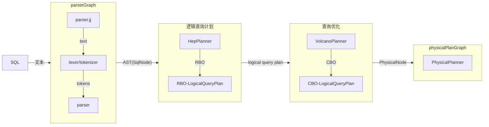
```mermaid
flowchart LR
	
	SQL -->|文本| parserGraph
	parserGraph -->|"AST(SqlNode)"| logicalQueryPlanGraph
	logicalQueryPlanGraph -->|logical query plan| queryOptimizeGraph
	queryOptimizeGraph -->|PhysicalNode| physicalPlanGraph

	subgraph parserGraph
		parser.jj -->|text| lexer[lexer/tokenizer] -->|tokens| parser
	end
	
	subgraph logicalQueryPlanGraph[逻辑查询计划]
		HepPlanner -->|RBO| RBO-LogicalQueryPlan 
	end
	
	subgraph queryOptimizeGraph[查询优化]
		VolcanoPlanner -->|CBO| CBO-LogicalQueryPlan
	end
	
	subgraph physicalPlanGraph
		PhysicalPlanner
	end
```

每个步骤涉及到的类如下：可以看到的是，在解析和逻辑计划阶段，其实都是与平台无关的，而到了物理机执行计划阶段，则会针对平台实现，例如我们下图中会存在Jdbc相关的类。

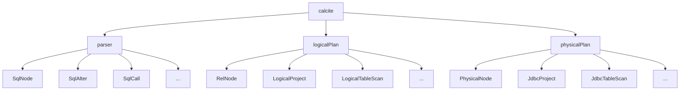
```mermaid
flowchart TD
	calcite --> parser
	calcite --> logicalPlan
	calcite --> physicalPlan
	
	parser --> SqlNode
	parser --> SqlAlter
	parser --> SqlCall
	parser --> Sql[...]
	
	logicalPlan --> RelNode
	logicalPlan --> LogicalProject
	logicalPlan --> LogicalTableScan
	logicalPlan --> Logical[...]
	
	physicalPlan --> PhysicalNode
	physicalPlan --> JdbcProject
	physicalPlan --> JdbcTableScan
	physicalPlan --> Physical[...]
```


### SqlOperator 和 SqlCall 的区别是什么

### 如何使用maven基于JavaCC生成解析类 && 如何将生成的解析类依赖加入到maven项目中

```xml
        <plugins>
            <plugin>
                <groupId>org.codehaus.mojo</groupId>
                <artifactId>javacc-maven-plugin</artifactId>
                <version>3.0.0</version>
                <executions>
                    <execution>
                        <phase>generate-sources</phase>
                        <id>javacc</id>
                        <goals>
                            <goal>javacc</goal>
                        </goals>
                        <configuration>
                            <sourceDirectory>${basedir}/src/main/javacc</sourceDirectory>
                            <includes>
                                <include>**/*.jj</include>
                            </includes>
                            <lookAhead>2</lookAhead>
                            <isStatic>false</isStatic>
                            <outputDirectory>${basedir}/generated-sources/</outputDirectory>
                        </configuration>
                    </execution>
                </executions>
            </plugin>


            <!-- add generated sources code to classpath -->
            <plugin>
                <groupId>org.codehaus.mojo</groupId>
                <artifactId>build-helper-maven-plugin</artifactId>
                <version>3.4.0</version>
                <executions>
                    <execution>
                        <id>add-source</id>
                        <phase>generate-sources</phase>
                        <goals>
                            <goal>add-source</goal>
                        </goals>
                        <configuration>
                            <sources>
                                <source>${basedir}/src/main/java/</source>
                                <source>${basedir}/generated-sources/</source>
                            </sources>
                        </configuration>
                    </execution>
                </executions>
            </plugin>

            <!-- clean generated sources when run command 'mvn clean' -->
            <plugin>
                <artifactId>maven-clean-plugin</artifactId>
                <version>2.4.1</version>
                <configuration>
                    <filesets>
                        <fileset>
                            <directory>${basedir}/generated-sources</directory>
                            <includes>
                                <include>**/*</include>
                            </includes>
                            <followSymlinks>false</followSymlinks>
                        </fileset>
                    </filesets>
                </configuration>
            </plugin>
        </plugins>
```

### SqlBasicCall和RexCall有什么区别？

> `RexCall` 和 `SqlBasicCall` 都表示函数调用，但是：
>
> 1. `RexCall` 在**logic query planner stage**生成，用于表示**查询计划**中的各种表达式（这个阶段我也会基于表达式去进行 `logic plan optimize`）；
> 2. `SqlBasicCall` 在 **SQL解析阶段**生成，用于表达**SQL查询语句**中的各种表达式。

在 Calcite 中，`RexCall` 和 `SqlBasicCall` 都是表示函数调用的类，但它们在 Calcite 的不同层次中扮演不同的角色。

1. `RexCall`:
   - `RexCall` 是 Calcite 中的一个类，用于表示表达式中的函数调用。
   - 它是 `RexNode` 接口的一个实现，用于表示**表达式树**中的函数调用节点。
   - `RexCall` 可以表示各种函数调用，包括内置函数和用户自定义函数。
   - 它提供了访问函数名称、参数列表和其他相关信息的方法。
2. `SqlBasicCall`:
   - `SqlBasicCall` 是 Calcite 中的一个类，用于表示 **SQL 解析树**中的函数调用。
   - 它是 `SqlNode` 接口的一个实现，用于表示 SQL 解析树中的函数调用节点。
   - `SqlBasicCall` 用于表示 SQL 查询中的函数调用，例如 SELECT、WHERE、GROUP BY 等子句中的函数调用。
   - 它提供了访问函数名称、参数列表和其他相关信息的方法。

总结来说，`RexCall` 是 Calcite 中用于表示表达式树中的函数调用的类，而 `SqlBasicCall` 是 Calcite 中用于表示 SQL 解析树中的函数调用的类。它们在 Calcite 的不同层次中扮演不同的角色，但都用于表示函数调用。

可以看到，这里提到了两个不同的阶段：`表达式树`和`SQL解析树`两个阶段。表达式树和 SQL 解析树中的函数调用有一些区别，并且它们在不同的阶段生成。

1. 表达式树中的函数调用：
   - 表达式树是在查询优化阶段生成的，用于表示查询计划中的各种表达式。
   - 函数调用在表达式树中表示为 `RexCall` 对象，用于表示函数的调用和参数。
   - 表达式树中的函数调用可以包括内置函数和用户自定义函数，用于执行各种计算和操作。
2. SQL 解析树中的函数调用：
   - SQL 解析树是在 SQL 解析阶段生成的，用于表示 SQL 查询语句的结构和语义。
   - 函数调用在 SQL 解析树中表示为 `SqlBasicCall` 对象，用于表示 SQL 查询语句中的函数调用。
   - SQL 解析树中的函数调用用于表示 SQL 查询语句中的函数调用，例如 SELECT、WHERE、GROUP BY 等子句中的函数调用。

> 总结来说，表达式树中的函数调用用于表示查询计划中的各种表达式，而 SQL 解析树中的函数调用用于表示 SQL 查询语句中的函数调用。它们在不同的阶段生成，表达式树在查询优化阶段生成，而 SQL 解析树在 SQL 解析阶段生成。

## 第三章 - sqlline

### 使用calcite内置的csv作为第一个例子

```bash
# 下载
git clone https://github.com/apache/calcite.git

cd calcite/example/csv

# 编译并进入sqlline
./sqlline

# 连接
!connect jdbc:calcite:model=src/test/resources/model.json admin admin
```

### sqlline的其他用法

```bash
# 查看当前所有连接
!list

# 跳转到0号连接
!go 0
```

### sqline的元数据

> 下面的是 `model.json` 文件
>
> 1. `name` 指定了模型名；
> 2. `type` 指定 `custom` 表示是用户自定义的；
> 3. `factory` 指定的数据模型工厂类的全路径；
> 4. `operand.directory` 指定了目录为 `sales`；

```json
{
  "version": "1.0",
  "defaultSchema": "SALES",
  "schemas": [
    {
      "name": "SALES",
      "type": "custom",
      "factory": "org.apache.calcite.adapter.csv.CsvSchemaFactory",
      "operand": {
        "directory": "sales"
      }
    }
  ]
}

```

### 集成CSV文件开发实例

>要在calcite中使用CSV，首先必须对CSV文件的格式进行定义

#### schema

> 1. `"name": "SALES"` 定义了schema的名字；
> 2. `"type:"custom` 指定schema类型为用户自定义；
> 3. `"factory"` 指定数据模型工厂；
> 4. `operand.directory` 指定了文件的位置； 

```json
{
  "version": "1.0",
  "defaultSchema": "SALES",
  "schemas": [
    {
      "name": "SALES",
      "type": "custom",
      "factory": "org.apache.calcite.adapter.csv.CsvSchemaFactory",
      "operand": {
        "directory": "sales"
      }
    }
  ]
}
```

#### 视图

> 可以在schema中创建视图；

```json
{
  "version": "1.0",
  "defaultSchema": "SALES",
  "schemas": [
    {
      "name": "SALES",
      "type": "custom",
      "factory": "org.apache.calcite.adapter.csv.CsvSchemaFactory",
      "operand": {
        "directory": "sales"
      },
      "tables": [
        {
          "name": "FEMALE_EMPS",
          "type": "view",
          "sql": "SELECT * FROM emps WHERE gender = 'F'"
        }
      ]
    }
  ]
}
```

#### CsvSchemaFactory

```java
public class CsvSchemaFactory implements SchemaFactory {
  /** Public singleton, per factory contract. */
  public static final CsvSchemaFactory INSTANCE = new CsvSchemaFactory();

  private CsvSchemaFactory() {
  }

  @Override public Schema create(SchemaPlus parentSchema, String name,
      Map<String, Object> operand) {
    // 查找目录
    final String directory = (String) operand.get("directory");
    final File base =
        (File) operand.get(ModelHandler.ExtraOperand.BASE_DIRECTORY.camelName);
    File directoryFile = new File(directory);
    if (base != null && !directoryFile.isAbsolute()) {
      directoryFile = new File(base, directory);
    }

    // 这个参数会指定CSV的表类型，分别是：
    // CsvTranslatableTable 用于描述可翻译的表（Translatable Table）的行为。它定义了翻译表到特定数据库的查询的方法。
    // CsvScannableTable 可扫描的表
    // CsvFilterableTable 用于处理可过滤的 CSV 格式表数据
    String flavorName = (String) operand.get("flavor");
    CsvTable.Flavor flavor;
    if (flavorName == null) {
      flavor = CsvTable.Flavor.SCANNABLE;
    } else {
      flavor = CsvTable.Flavor.valueOf(flavorName.toUpperCase(Locale.ROOT));
    }
    return new CsvSchema(directoryFile, flavor);
  }
}
```

#### CsvSchema

```java
  @Override protected Map<String, Table> getTableMap() {
    if (tableMap == null) {
      tableMap = createTableMap();
    }
    return tableMap;
  }

  private Map<String, Table> createTableMap() {
    // 查找所有.gz, .csv, .json 结尾的文件
    final Source baseSource = Sources.of(directoryFile);
    File[] files = directoryFile.listFiles((dir, name) -> {
      final String nameSansGz = trim(name, ".gz");
      return nameSansGz.endsWith(".csv")
          || nameSansGz.endsWith(".json");
    });
    if (files == null) {
      System.out.println("directory " + directoryFile + " not found");
      files = new File[0];
    }
    // Build a map from table name to table; each file becomes a table.
    final ImmutableMap.Builder<String, Table> builder = ImmutableMap.builder();
    for (File file : files) {
      // 获取source
      Source source = Sources.of(file);
      Source sourceSansGz = source.trim(".gz");

      // 处理json数据源并转换为table
      final Source sourceSansJson = sourceSansGz.trimOrNull(".json");
      if (sourceSansJson != null) {
        final Table table = new JsonScannableTable(source);
        builder.put(sourceSansJson.relative(baseSource).path(), table);
      }

      // 处理csv数据源并转换为table
      final Source sourceSansCsv = sourceSansGz.trimOrNull(".csv");
      if (sourceSansCsv != null) {
        final Table table = createTable(source);
        builder.put(sourceSansCsv.relative(baseSource).path(), table);
      }
    }
    return builder.build();
  }

  /** Creates different sub-type of table based on the "flavor" attribute. */
  private Table createTable(Source source) {
    switch (flavor) {
    case TRANSLATABLE:
      return new CsvTranslatableTable(source, null);
    case SCANNABLE:
      return new CsvScannableTable(source, null);
    case FILTERABLE:
      return new CsvFilterableTable(source, null);
    default:
      throw new AssertionError("Unknown flavor " + this.flavor);
    }
  }
```

## 第四章- 数据库查询优化技术

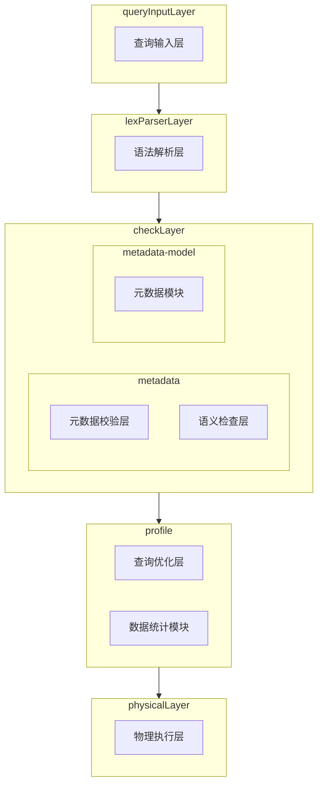
```mermaid
flowchart TD
	queryInputLayer --> lexParserLayer --> checkLayer --> profile --> physicalLayer

	subgraph queryInputLayer
		查询输入层
	end
	subgraph lexParserLayer
		语法解析层
	end
	subgraph checkLayer
		subgraph metadata
			元数据校验层
			语义检查层
		end
		subgraph metadata-model
			元数据模块
		end
	end
	subgraph profile
		查询优化层
		数据统计模块
	end
	
	subgraph physicalLayer
		物理执行层
	end
```


### 4.3 逻辑计划优化

> `投影运算符(project)` --> `SELECT x,y FROM table_name;`

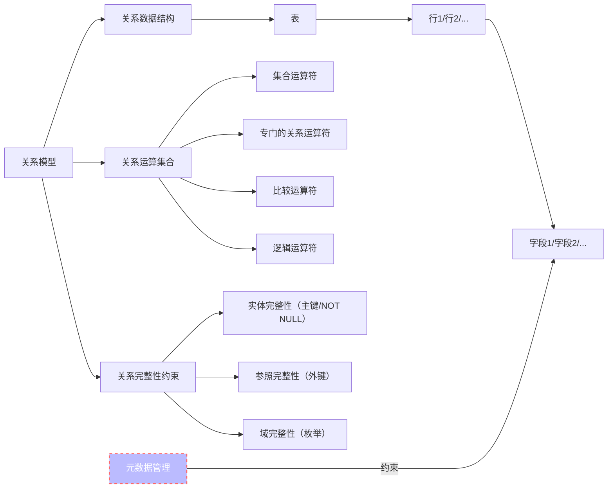
```mermaid
flowchart LR
	关系模型
	
	关系模型 --> 关系数据结构
	关系模型 --> 关系运算集合
	关系模型 --> 关系完整性约束
	
	关系数据结构 --> 表 --> 行1[行1/行2/...] --> 字段[字段1/字段2/...]
	
	元数据管理:::important ---->|约束| 字段
	
	关系运算集合 --> 集合运算符
	关系运算集合 --> 专门的关系运算符
	关系运算集合 --> 比较运算符
	关系运算集合 --> 逻辑运算符
	
	关系完整性约束 --> 实体完整性["实体完整性（主键/NOT NULL）"]
	关系完整性约束 --> 参照完整性["参照完整性（外键）"]
	关系完整性约束 --> 域完整性["域完整性（枚举）"]

classDef important fill:#bbf,stroke:#f66,stroke-width:2px,color:#fff,stroke-dasharray: 5 5
```


#### 4.3.2 关系代数优化规则

>优化就是基于关系代数的等价转换。
>
>
>
>谓词下推（predicate pushdown）会把所有的WHERE条件挪动到最接近数据源的位置，这样可以在查询的时候花费最小代价；
>
>
>
>常量折叠：在查询优化器处计算所有能计算的，降低查询引擎负载；
>
>
>
>列裁剪：只查询需要的列，可能需要查询引擎配合；
>
>
>
>条件简化：

#### 谓词下推

```sql
SELECT
	t1.name,
	t2.age,
	t2.class,
	t2.income
FROM
	t1
INNER JOIN
	t2
ON
	t1.id = t2.id
WHERE
	t2.age > 18;
```

> 优化后

```sql
SELECT
	t1.name,
	t3.age,
	t3.class,
	t3.income
FROM
	t1
INNER JOIN
	(
  	SELECT
    	t2.id,
    	t2.age,
	    t2.class,
    	t2.income
    FROM
    	t2
    WHERE
    	t2.age > 18
  ) AS t3
ON
	t1.id = t3.id
```

### 4.4 物理计划优化

> 相对于传统数据库的架构：
>
> ```mermaid
> flowchart LR
> 	CPU <--> 一级缓存  <--> 二级缓存 <--> 三级缓存 <--> 内存 <--> 硬盘
> ```
>
> 

相比与逻辑计划优化，物理计划更贴近于计算机的物理层面。距离来说，当我们做逻辑优化的时候，我们不需要考虑计算运行于intel还是amd的CPU，也不需要考虑硬盘使用的是SSD还是普通的机械硬盘诸如此类的问题。


在执行物理计划优化之前，我们必须有一个方法来估算我们的查询代价，这个估算的依据就是我们的代价模型；


传统的单机数据我们主要考虑的是I/O和CPU的开销：

> - `page_num` 查询的页数
> - `cpu_time_per_page` 每页消耗的CPU时间
> - `cpu_cost` 计算代价，包括数据的处理、过滤等

```
cost() = page_num * cpu_time_per_page + cpu_cost
```

> 很多新的分布式数据库，我们还需要考虑服务器之间通信的开销。
>
> ```mermaid
> flowchart LR
> 
>  machine1 <-->|网络通信| machine2 <-->|网络通信| machine3
> 
> 	subgraph machine1
> 		direction LR
> 		CPU1[cpu]
> 		memory1[memory]
> 		disk1[disk]
> 	end
> 	subgraph machine2
> 		direction LR
> 		CPU2[cpu]
> 		memory2[memory]
> 		disk2[disk]
> 	end
> 	subgraph machine3
> 		direction LR
> 		CPU3[cpu]
> 		memory3[memory]
> 		disk3[disk]
> 	end
> 	
> ```
>
> 


> 在更具体的优化中，我们还拆分了

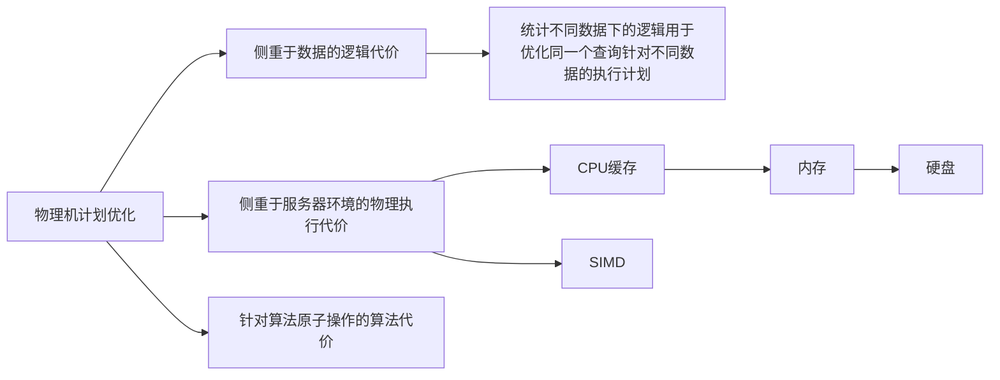
```mermaid
flowchart LR

	物理机计划优化 --> 侧重于数据的逻辑代价 --> 统计不同数据下的逻辑用于优化同一个查询针对不同数据的执行计划
	物理机计划优化 --> 侧重于服务器环境的物理执行代价 --> CPU缓存 --> 内存 --> 硬盘
	侧重于服务器环境的物理执行代价 --> SIMD
	物理机计划优化 --> 针对算法原子操作的算法代价
```

### 优化模型

优化模型主要分为：

1. 启发式模型；
2. 火山模型；
3. 向量模型；

其中启发式模型主要是源于启发式算法，在可接受的代价范围内给出对应组合优化问题的每一个实例一个可行解。有可能性能很好，但是也有可能性能很差，现在使用已经不多了。

火山模型是将整个关系代数中的每一个操作都抽象为一个运算符，将整个SQL的逻辑结构抽象为一个运算符树。**查询操作由根节点发起，通过next接口一步一步向查询引擎发送。数据被自下而上逐级拉起，如同火山喷发因此命名为火山模型。**

```sql
SELECT 
	id,
	name,
	age
FROM
	people
WHERE
	age > 30;
```

以上SQL会被抽象为

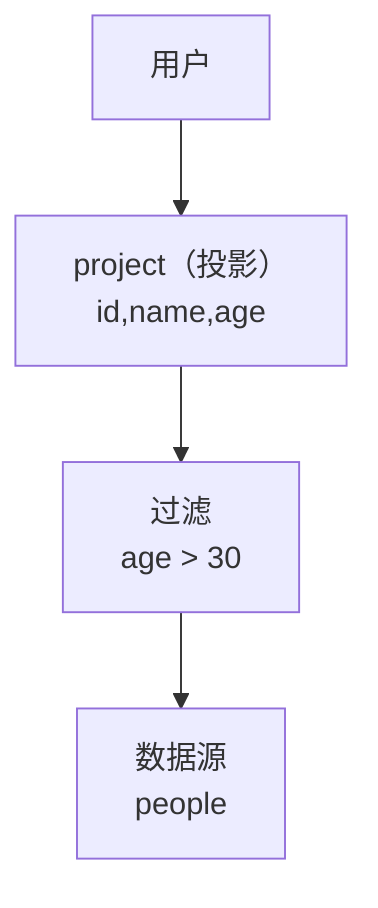
```mermaid
flowchart TD
	user[用户]
	project["project（投影）\nid,name,age"]
	filter[过滤\nage > 30]
	data[数据源\npeople]

user --> project
project --> filter
filter --> data
```


火山模型每次调用会调用next节点，从而带来大量的数据类型的判断逻辑，大量的虚函数调用。我们一般通过动态代码生成技术来优化性能。


向量化模型是火山模型的改良版，也是通过操作符树来组织查询逻辑，利用迭代的方式向上拉取数据。但是底层拉取的数据不再是单行而是多行数据。


## 第五章 - 服务层

### 5.1 Avatica架构介绍

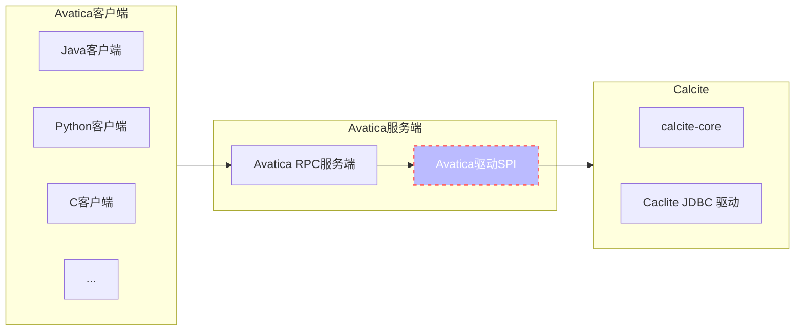
```mermaid
flowchart LR
	Avatica客户端 --> AvaticaRPC服务端
	Avatica驱动SPI --> Calcite
	subgraph Avatica服务端
		direction BT
		AvaticaRPC服务端 --> Avatica驱动SPI
		Avatica驱动SPI:::important
		AvaticaRPC服务端[Avatica RPC服务端]
	end
	
	subgraph Calcite
		direction LR
		calcite-core
		CalciteJDBC[Caclite JDBC 驱动]
	end
	
	subgraph Avatica客户端
		direction LR
		Java客户端
		Python客户端
		C客户端
		其他客户端[...]
	end

classDef important fill:#bbf,stroke:#f66,stroke-width:2px,color:#fff,stroke-dasharray: 5 5
```

>为了扩展，Avatica服务端使用了 `SPI(Service Provider Interface)`，服务提供方在 `META-INF/services` 下声明一些类的全路径，这些类实现了服务定义方的服务接口。在代码运行时，服务定义方能够在这个目录下找到自己服务接口的实现类，然后加载并运行。

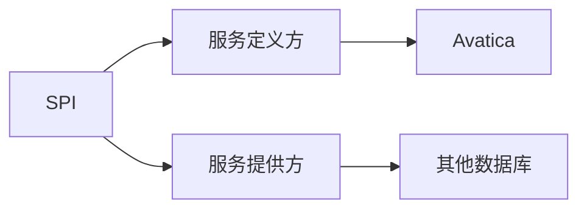
```mermaid
flowchart LR
	SPI --> 服务定义方 --> Avatica
	SPI --> 服务提供方 --> 其他数据库
```


### 5.2 Avatica执行结构和流程

> - `Server` API for request-response calls to an Avatica server.
> - `Meta` Command handler for getting various metadata. Should be implemented by each driver.

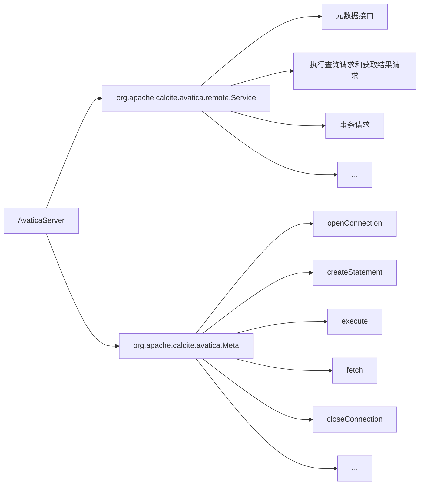
```mermaid
flowchart LR
	AvaticaServer --> Service["org.apache.calcite.avatica.remote.Service"]
	AvaticaServer --> Meta["org.apache.calcite.avatica.Meta"]
	
	Service --> 元数据接口
	Service --> 执行查询请求和获取结果请求
	Service --> 事务请求
	Service --> otherService[...]
	
	Meta --> openConnection
	Meta --> createStatement
	Meta --> execute
	Meta --> fetch
	Meta --> closeConnection
	Meta --> otherMeta[...]
```

#### 5.2.1 Service接口

##  第六章 - 解析层

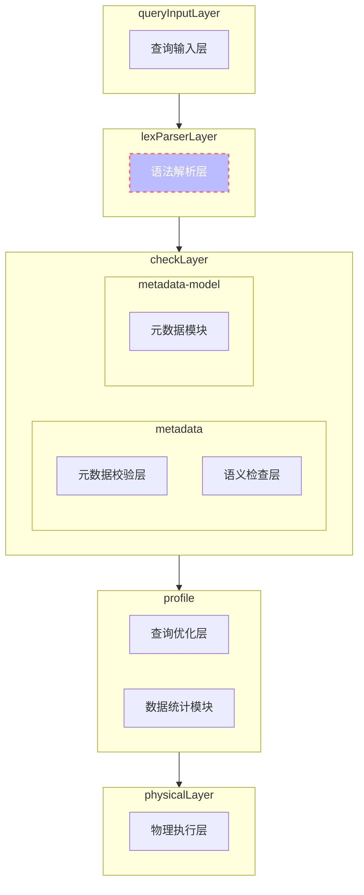
```mermaid
flowchart TD
	queryInputLayer --> lexParserLayer --> checkLayer --> profile --> physicalLayer

	subgraph queryInputLayer
		查询输入层
	end
	subgraph lexParserLayer
		语法解析层:::important
	end
	subgraph checkLayer
		subgraph metadata
			元数据校验层
			语义检查层
		end
		subgraph metadata-model
			元数据模块
		end
	end
	subgraph profile
		查询优化层
		数据统计模块
	end
	
	subgraph physicalLayer
		物理执行层
	end

classDef important fill:#bbf,stroke:#f66,stroke-width:2px,color:#fff,stroke-dasharray: 5 5
```

### 6.1 语法解析过程

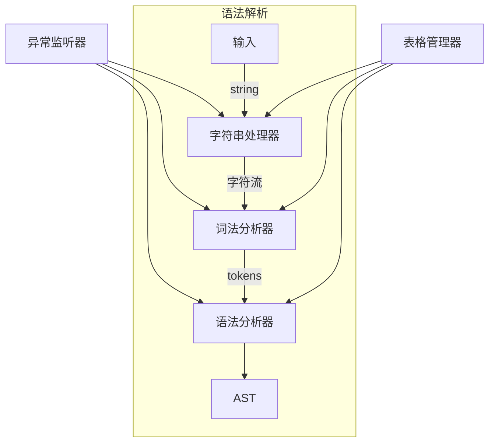
```mermaid
flowchart TB
异常监听器 --> 字符串处理器
异常监听器 --> 词法分析器
异常监听器 --> 语法分析器

subgraph 语法解析
	direction TB
	string["输入"] -->|string| 字符串处理器 -->|字符流| 词法分析器 -->|tokens| 语法分析器 --> AST
end


表格管理器 --> 字符串处理器
表格管理器 --> 词法分析器
表格管理器 --> 语法分析器
```


### 6.2 Calcite解析体系

#### 6.2.2 SqlNode 体系

`SqlNode` 是 SQL 中的一个解析树（parse tree）；可能是 `SqlLiteral`,`SqlCall`, `SqlOperator`, `SqlIdentifier`。

其中`SqlLiteral`,`SqlCall`, `SqlIdentifier`都是 SqlNode 的子类。

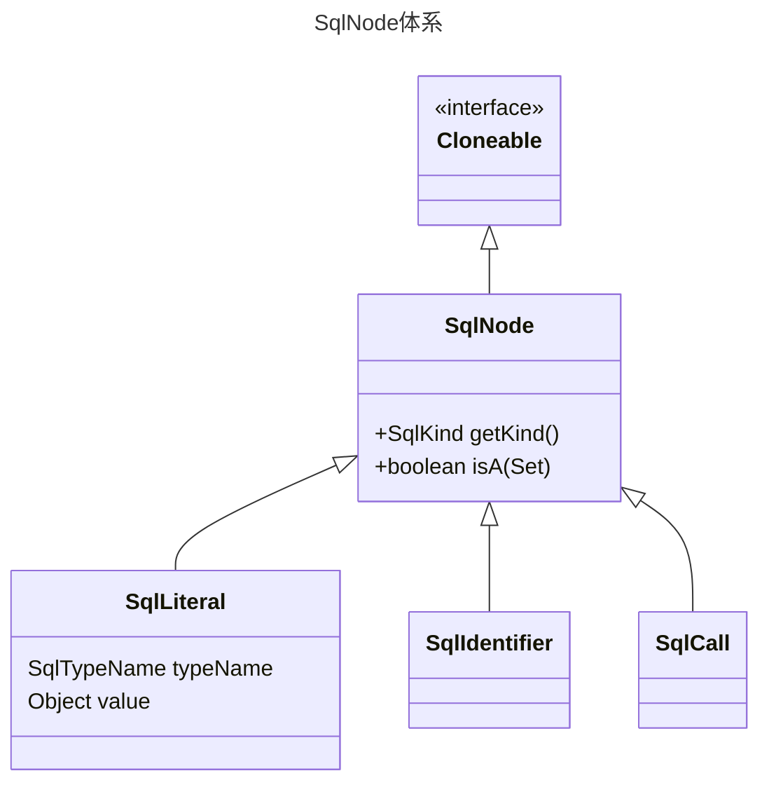
```mermaid
---
title: SqlNode体系
---
classDiagram
	class Cloneable {
		<<interface>>
	}
	class SqlNode {
		+SqlKind getKind()
		+boolean isA(Set<SqlKind>)
	}
	
	class SqlLiteral {
		SqlTypeName typeName
		Object value
	}
	Cloneable <|-- SqlNode
	
	SqlNode <|-- SqlLiteral
	SqlNode <|-- SqlIdentifier
	SqlNode <|-- SqlCall
```


> - `SqlLiteral` SQL 中的字面量；
> - `SqlCall` 是对 `SqlOperator` 的一次调用；`Operator` 可用于描述任何语法结构，因此实际上，SQL 解析树中的每个非叶节点都是某种 SqlCall；
> - `SqlIdentifier` SQL 中的 identifier，例如 select 语句中的字段，where 语句后的跟的表。

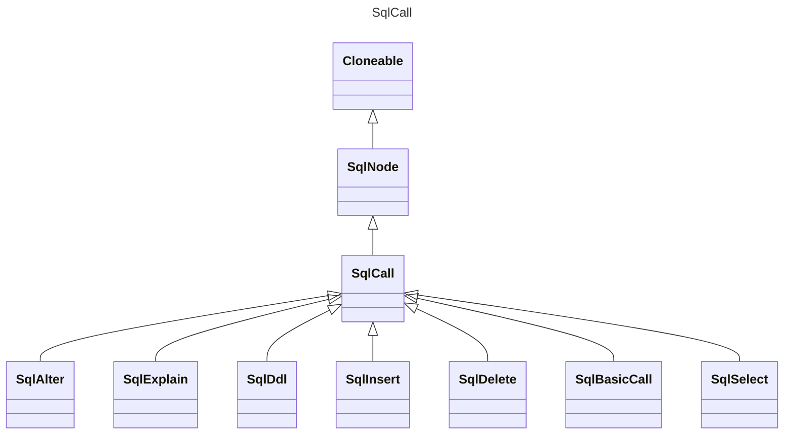
```mermaid
---
title: SqlCall
---
classDiagram
	Cloneable <|-- SqlNode
	SqlNode <|-- SqlCall
	SqlCall <|-- SqlAlter
	SqlCall <|-- SqlExplain
	SqlCall <|-- SqlDdl
	SqlCall <|-- SqlInsert
	SqlCall <|-- SqlDelete
	SqlCall <|-- SqlBasicCall
	SqlCall <|-- SqlSelect
```


##### SqlSelect

一个标准的SQL语句类似于如下结构

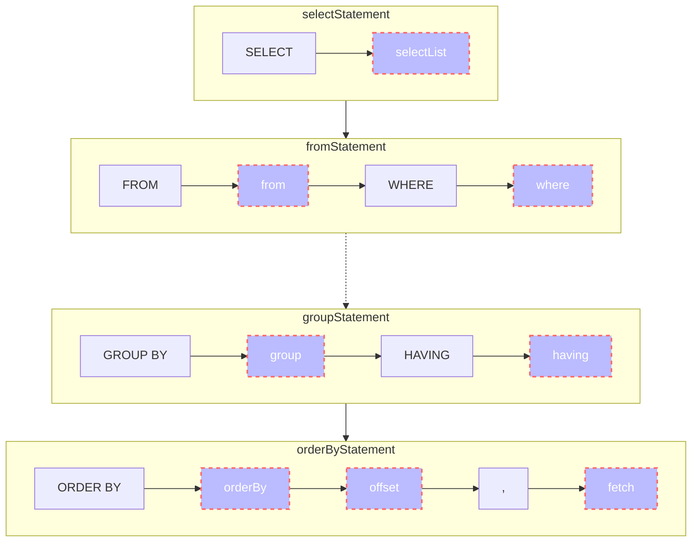
```mermaid
---
select语句结构
---
flowchart TB
	selectStatement --> fromStatement
	subgraph selectStatement
		direction LR
		SELECT --> selectList:::important
	end
	
	subgraph fromStatement
		FROM --> from["from"]:::important
		from --> WHERE --> where["where"]:::important
	end

	fromStatement -..-> groupStatement
	subgraph groupStatement
		GROUPBY["GROUP BY"] --> group:::important
		group --> HAVING
		HAVING --> having:::important
	end
	groupStatement --> orderByStatement
	subgraph orderByStatement
		ORDERBY["ORDER BY"] --> orderBy:::important --> offset:::important --> dot[","] --> fetch:::important
	end
	

classDef important fill:#bbf,stroke:#f66,stroke-width:2px,color:#fff,stroke-dasharray: 5 5
```

所以，在 SqlSelect 的代码中，我们包含了如下属性，最终会生成一颗语法树，而这些 `selectList`， `from` 等都会成为 **SqlSelect的子节点。**

```java
public class SqlSelect extends SqlCall {

  // constants representing operand positions
  public static final int FROM_OPERAND = 2;
  public static final int WHERE_OPERAND = 3;
  public static final int HAVING_OPERAND = 5;

  SqlNodeList keywordList;
  SqlNodeList selectList;
  SqlNode from;
  SqlNode where;
  SqlNodeList groupBy;
  SqlNode having;
  SqlNodeList windowDecls;
  SqlNodeList orderBy;
  SqlNode offset;
  SqlNode fetch;
  SqlNodeList hints;
}
```

##### SqlInsert

同理，一个 `SqlInsert` 也是类似的结构

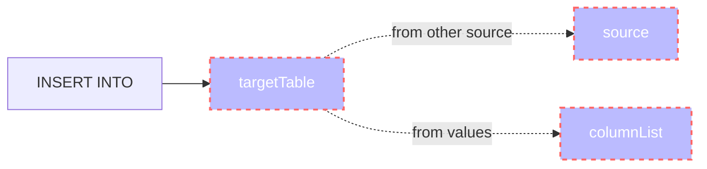
```mermaid
flowchart LR
	INSERT["INSERT INTO"] --> targetTable:::important -..->|from other source| source:::important
	targetTable -..->|from values| columnList:::important
classDef important fill:#bbf,stroke:#f66,stroke-width:2px,color:#fff,stroke-dasharray: 5 5
```


对应的属性如下：

```java
public class SqlInsert extends SqlCall {
  SqlNodeList keywords;
  SqlNode targetTable;
  SqlNode source;
  SqlNodeList columnList;
}
```

我们可以观察到，这里可能是 `source` 或者 `columnList`，这是因为我们的 INSERT 语法有两种模式：

```sql
# from another source
INSERT INTO targetTable(...) SELECT (...) FROM ...;

# from values
INSERT INTO targetTable(...) VALUES (...)
```

##### SqlNode工作方式示例SQL语句

```sql
SELECT
	id
FROM t
WHERE id > 1;
```

根据我们前面的知识，我们可以推断出来这个SQL会形成一个如下AST，注意SqlNodeList、SqlBasicCall、SqlOperator的定义

```java
// SqlNodeList 是一个 SqlNode 的集合
public class SqlNodeList extends SqlNode implements Iterable<SqlNode> {

}
```

```java
// SqlBasicCall 是 SqlNode 的子类，并且持有一个 SqlOperator
public class SqlBasicCall extends SqlCall {
  private SqlOperator operator;
  public final SqlNode[] operands;
  private final SqlLiteral functionQuantifier;
  private final boolean expanded;
}

public abstract class SqlCall extends SqlNode {
}
```


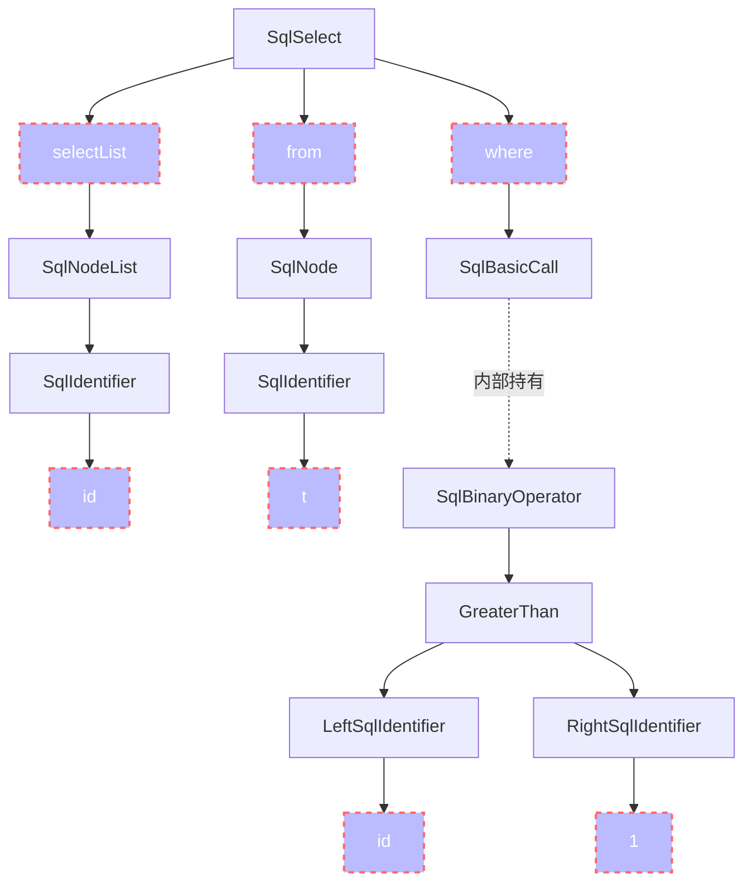
```mermaid
flowchart TB
	SqlSelect --> selectList:::important
	SqlSelect --> from:::important
	SqlSelect --> where:::important
	
	selectList --> SqlNodeList
	SqlNodeList --> SqlIdentifier --> selectNodeIdentifier["id"]:::important
	
	from --> FromSqlNode["SqlNode"] --> FromSqlIdentifier["SqlIdentifier"] --> FromStatement["t"]:::important
	
	where --> SqlBasicCall["SqlBasicCall"]
	SqlBasicCall -..->|内部持有| SqlBinaryOperator --> GreaterThan
	GreaterThan --> LeftSqlIdentifier --> Left["id"]:::important
	GreaterThan --> RightSqlIdentifier --> Right["1"]:::important
	
classDef important fill:#bbf,stroke:#f66,stroke-width:2px,color:#fff,stroke-dasharray: 5 5
```


### 6.3 JavaCC

参考 [javacc](./javacc.md)

### 6.4 Calcite整合Antlr方法

#### 设置maven插件

Antlr4 的依赖包含运行时依赖和插件依赖，运行时依赖较为简单我们只说插件依赖。

> 1. 我们在插件依赖中指定了 `-package` 引用一个特定的包名；
> 2. 我们声明了一个 `antlr4` 的 `execution`，并且绑定到 `phase` = `generate-sources`，`goal=antlr4` 上；
> 3. 指定了输入文件夹和输出文件夹，并且输出文件夹绑定到了 `-package` 对应的包下。

```xml
<?xml version="1.0" encoding="UTF-8"?>
<project>
    <dependencies>
        <dependency>
            <groupId>org.antlr</groupId>
            <artifactId>antlr4</artifactId>
            <version>4.11.1</version>
        </dependency>

        <dependency>
            <groupId>org.antlr</groupId>
            <artifactId>antlr4-runtime</artifactId>
            <version>${antlr4.version}</version>
        </dependency>
    </dependencies>

    <build>
        <plugins>
            <!-- antlr4 plugin -->
            <plugin>
                <groupId>org.antlr</groupId>
                <artifactId>antlr4-maven-plugin</artifactId>
                <version>4.3</version>
                <configuration>
                    <arguments>
                        <argument>-package</argument>
                        <argument>${antlr4.package.name}</argument>
                    </arguments>
                </configuration>
                <executions>
                    <execution>
                        <id>antlr4</id>
                        <phase>generate-sources</phase>
                        <goals>
                            <goal>antlr4</goal>
                        </goals>
                        <configuration>
                            <sourceDirectory>${basedir}/src/main/g4</sourceDirectory>
                            <includes>
                                <include>**/*.g4</include>
                            </includes>
                            <outputDirectory>${basedir}/generated-sources/${antlr4.package.name}</outputDirectory>
                        </configuration>
                    </execution>
                </executions>
            </plugin>
        </plugins>
    </build>
</project>
```


> 使用antlr4匹配LOAD语法
>
> ```
> LOAD hdfs:'default/user.txt' TO mysql:'db.t_user' (name name, age age) SEPARATOR ','
> ```

```java

```

## 第7章-校验层

### 7.1 何谓校验

查询执行需要根据**元数据信息**来进行校验例如：

1. 完善语义信息，例如将 select * 转换为合法的字段；
2. 确认语义是否合法，例如确认 select id from login group by id; 需要确认语句中的login是否存在，id是否存在 group by id是否合法；

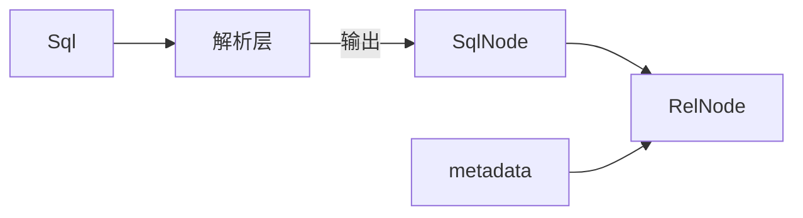
```mermaid
flowchart LR
	Sql --> 解析层 -->|输出| SqlNode --> RelNode
	metadata --> RelNode
```


### 7.2 元数据定义

#### 7.2.1 calcite中元数据的基本概念

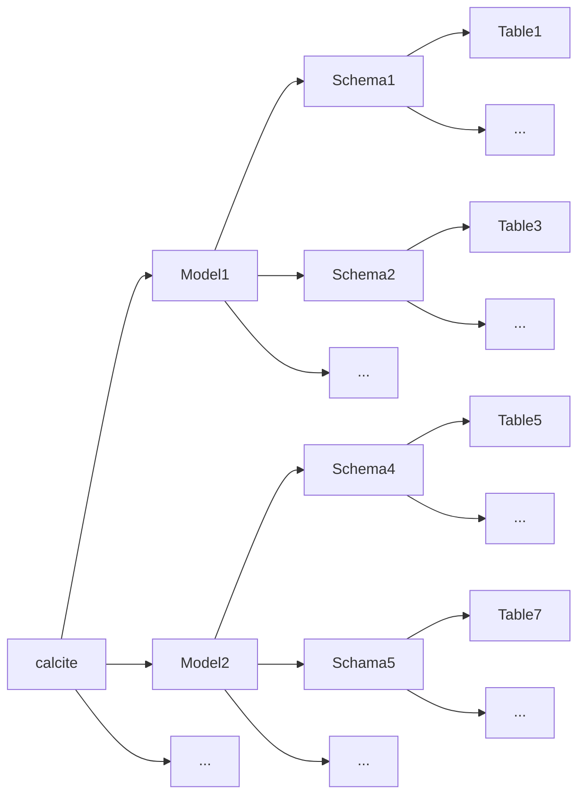
```mermaid
flowchart LR
	calcite --> Model1
	calcite --> Model2
	calcite --> Model3[...]
	
	Model1 --> Schema1
	Model1 --> Schema2
	Model1 --> Schema3[...]
	
	Model2 --> Schema4
	Model2 --> Schama5
	Model2 --> Schame6[...]
	
	Schema1 --> Table1
	Schema1 --> Table2[...]
	
	Schema2 --> Table3
	Schema2 --> Table4[...]

	Schema4 --> Table5
	Schema4 --> Table6[...]
	
  Schama5 --> Table7
	Schama5 --> Table8[...]
```

##### 1. Model

> 暂时不支持图数据库模型

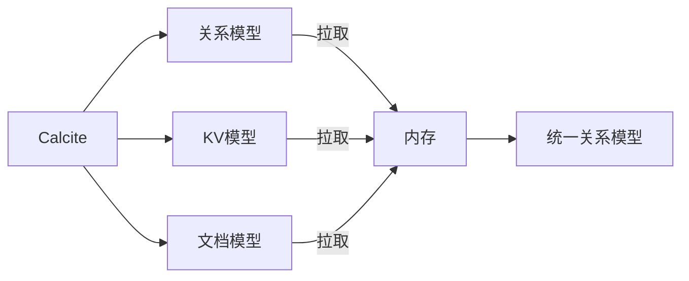
```mermaid
flowchart LR
	Calcite --> 关系模型 -->|拉取| 内存 
	Calcite --> KV模型 -->|拉取| 内存
	Calcite --> 文档模型 -->|拉取| 内存
	
	内存 --> 统一关系模型
```


##### 2. Schema

> Schema : `a persistent, named collection of descriptor`。
>
> 
>
> 包含了表、列、数据类型、视图、存储过程、关系、主键、外键等概念。

##### 3. Table

calcite中，它的表是关系代数中的表格 -- 由一些约束条件进行约束的二维数组集。

#### 7.2.2 数据模型（Model）定义

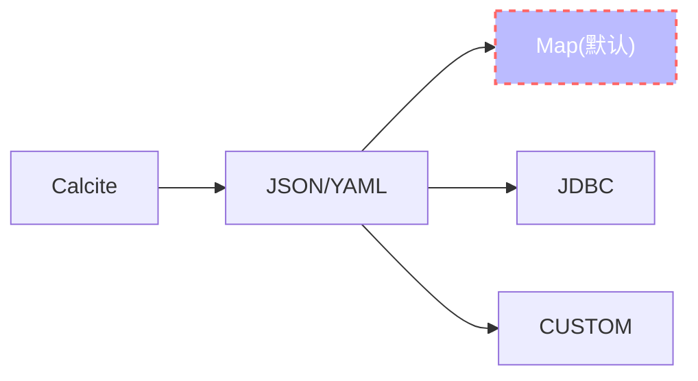
```mermaid
flowchart LR
	Calcite --> JSON/YAML --> Map["Map(默认)"]:::important
	JSON/YAML --> JDBC
	JSON/YAML --> CUSTOM
	
classDef important fill:#bbf,stroke:#f66,stroke-width:2px,color:#fff,stroke-dasharray: 5 5
```


> model.json

```json
{
  "version": "1.0",
  "defaultSchema": "MYSQL",
  "schemas": [
  ]
}
```

##### custom

```mermaid
flowchart LR
	Custom --> factory
	Custom --> operand
	Custom --> functions
	Custom --> tables
```


```json
    {
      "name": "MYSQL",
      "type": "custom",
      "factory": "cn.com.ptpress.cdm.schema.mysql.MysqlSchemaFactory",
      "operand": {
        "url": "jdbc:mysql://localhost:3306/db_cdm",
        "user": "root",
        "pass": "root"
      },
      "functions": [
        {
          "name": "test",
          "className": "cn.com.ptpress.cdm.schema.function.MyFunction",
          "methodName": "test"
        }
      ],
      "tables": [
        {
          "name": "v_num",
          "type": "view",
          "sql": "select 1+2*3",
          "path": [
            "MYSQL"
          ],
          "modifiable": false
        }
      ]
    }
```

#### 7.2.3 自定义表元数据实现

```mermaid
flowchart LR
	SchemaFactory -->|create| Schema
	Schema -->|namespace for| Table
	Schema -->|namespace for| functions
```


所以，如果我们需要定义一个自己的 `Schema`，我们至少需要定义三个类：

1. SchemaFactory
2. Schema
3. Table

##### SchemaFactory

>Factory for Schema objects.
>A schema factory allows you to include a custom schema in a model file. For example, here is a model that contains a custom schema whose tables read CSV files. (See the example CSV adapter  for more details about this particular adapter.)
>
>```json
>{
>    "version": "1.0",
>    "defaultSchema": "SALES",
>    "schemas": [
>        {
>            "name": "SALES",
>            "type": "custom",
>            "factory": "org.apache.calcite.adapter.csv.CsvSchemaFactory",
>            "mutable": true,
>            "operand": {
>                "directory": "sales"
>            },
>            "tables": [
>                {
>                    "name": "FEMALE_EMPS",
>                    "type": "view",
>                    "sql": "SELECT * FROM emps WHERE gender = 'F'"
>                }
>            ]
>        }
>    ]
>}
>```
>
>

```java
public interface SchemaFactory {
  /** Creates a Schema.
   *
   * @param parentSchema Parent schema
   * @param name Name of this schema
   * @param operand The "operand" JSON property
   * @return Created schema
   */
  Schema create(
      SchemaPlus parentSchema,
      String name,
      Map<String, Object> operand);
}
```

##### 一个简单的使用calcite映射mysql到calcite的实例

> 使用如下代码进入 SchemaFactory
>
> ```java
> DriverManager.getConnection("jdbc:calcite:model=src/main/resources/model.json")
> ```

```mermaid
flowchart TD

	`model.json` -->|config| SchemaFactory
	
	subgraph SchemaGraph[Schema]
		SchemaFactory -->|create| Schema
	end

	subgraph TableGraph[Table]
		MyTable -->|inherit| AbstractTable
		MyTable -->|contains| MyTableColumns
	end

	subgraph columnsGraph[Columns]
		direction LR
		subgraph columns1[columns1]
			ColumnName1[ColumnName1]
			ColumnType1[ColumnType]
		end
		subgraph columns2[columns2]
			ColumnName2[ColumnName]
			ColumnType2[ColumnType]
		end
		subgraph columns3[...]
			ColumnName3[...]
			ColumnType3[...]
		end
	end
	
	TableGraph --> columnsGraph
	
	Schema -->|getTableMap| MyTable
```


## 第8章 - 优化层

### 8.1 关系代数与火山模型

```sql
# 原始SQL
SELECT t1.id,
       t2.name
FROM t1
JOIN t2 ON t1.id=t2.id
WHERE t1.socre = 90;
```

可以被转换为如下代数模型


```mermaid
flowchart TD
	Scan1[Scan: t1] --> Join[Join: t1.id=t2.id]
	Scan2[Scan: t2] --> Join
	Join --> Filter[Filter: t1.score=90]
	Filter --> Project[Project: t1.id, t2.name]
```


经过优化之后可以变成

```mermaid
flowchart TD
	Scan1 --> Filter[Filter: t1.score=90]
	Filter --> Project1[Project: t1.id]
	Project1 --> Join[Join: t1.id=t2.id]
	Scan2[Scan: t2] --> Project[Project: t2.id,t2.name] --> Join
```

### 8.2 优化器

#### 8.2.2 RBO(Rule-Based Optimizer) and CBO(Cost-Based Optimizer)

> - `RBO` A Rule-Based Optimizer (RBO) is a component in a database management system (DBMS) that determines the most efficient way to execute a database query **by following a set of predefined rules**
> - `CBO` The cost-based optimizer uses **metadata and statistics** to estimate the amount of processing (memory, CPU, network traffic, and I/O) required for each operation.

##### RBO

> 当匹配到一个节点，父节点是 join 子节点是 filter，我们就可以转换为父节点为 filter，子节点为 join

```mermaid
flowchart LR
	input -->|RBO| output

	subgraph input
		Filter0[Filter] --> Join0[Join]
	end
	
	subgraph output
		Join1[Join] --> Filter1[Filter]
	end
```

##### CBO

1. Hash Join 利用连接键的hash值分桶存储链接表
2. Nested Join 将一个表存在内存，并循环从另外的表查询数据并连接
3. Sort Merge Join 先将关联表的关联各自排序，然后从各自排序表抽取数据并连接

```mermaid
flowchart LR
	Join --> HashJoin[Hash Join]
	Join --> NestedJoin[Nested Join]
	Join --> SortMergeJoin[Sort Merge Join]
```

#### 8.2.3 寻找关系代数最优解

在寻找最优解的过程中，可能会同时匹配多个优化规则，也可能优化完之后可以继续优化，一般使用贪心算法来得出相对最优解而不追求全局最优解。这个是非常合理的，因为我们优化本身的代价也需要考虑在内。

### 8.3 calcite优化器

```mermaid
classDiagram
	  note "RBO模型和CBO模型"
    RelOptPlanner <|-- AbstactRelOptPlanner
    AbstactRelOptPlanner <|-- HepPlanner
    AbstactRelOptPlanner <|-- VolcanoPlaner
```

#### 8.3.1 构建算子树

##### config()

```java
    public static Frameworks.ConfigBuilder config() {
        return config("data.csv");
    }

    public static Frameworks.ConfigBuilder config(String dataFile) {
        // create a root schema
        final SchemaPlus rootSchema = Frameworks.createRootSchema(true);
        SchemaPlus rootSchemaPlus = rootSchema.add("csv", new CsvSchema(dataFile));
        return Frameworks.newConfigBuilder()
                         // define the configuration for a SQL parser, use Oracle lexer
                         .parserConfig(SqlParser.Config.DEFAULT)
                         // add schema csv, and table name data to rootSchema
                         .defaultSchema(rootSchemaPlus);
    }
```

```java
    @Test
    public void joinTest() {
        final FrameworkConfig config = MyRelBuilder.config().build();
        final RelBuilder builder = RelBuilder.create(config);
        final RelNode left = builder
                .scan("STUDENT")
                .scan("SCORE")
                .join(JoinRelType.INNER, "ID")
                .build();

        final RelNode right = builder
                .scan("CITY")
                .scan("SCHOOL")
                .join(JoinRelType.INNER, "ID")
                .build();

        final RelNode result = builder
                .push(left)
                .push(right)
                .join(JoinRelType.INNER, "ID")
                .build();
        System.out.println(RelOptUtil.toString(result));
    }

```

以上代码将会构建如下算子树

```mermaid
flowchart TD

scan1[Scan STUDENT]
scan2[Scan SCORE]
scan1 --> join1[join]
scan2 --> join1

scan3[Scan STUDENT]
scan4[Scan SCORE]
scan3 --> join2[join]
scan4 --> join2

join1 --> join3[join]
join2 --> join3
```

#### 8.3.2 RelNode

> A `RelNode` is a relation Expression created in `Logical Query Planner Stage` and used in `Optimize Stage`.

```mermaid
classDiagram
		note "RelOptNode is node in planner"
    RelOptNode <|-- RelNode
    Clonable <|-- RelNode
	  note "A RelNode is a relational Expression"
	  RelNode <|-- Project
    RelNode <|-- Sort
    RelNode <|-- Join
    RelNode <|-- Filter
    RelNode <|--  TableScan
```

```mermaid
classDiagram
	note "RexNode is a row Expression, Rex stands for row-expression"
	RexNode <|-- RexVariable
	RexNode <|-- RexCall
	RexNode <|--RexLiteral
	RexVariable <|-- RexInputRef
	RexVariable <|-- RexLocalRef
```

#### 8.3.3 Calcite优化模型

##### HepPlanner

在 HepPlanner 的优化过程中，有一些重要的类：

1. `OperandBuilder` ：Callback to create an operand.
2. `Done` Indicates that an operand is complete.
3. `OperandTransform extends Function<OperandBuilder, Done>` ，继承了 Function 的 `apply` 方法，接收一个 `OperandBuilder` 参数并返回 `Done`.
4. `RelRule.Config` inner class of RelRule, indicate a rule configuration.
5. `FilterJoinRule.Config extends RelRule.Config` inner class of FilterJoinRule, indicate a rule configuration but contains more function.

> 在 `RelRule.Config` 中有一些常用的方法和变量：
>
> 1. `EMPTY` 通常用于构造一个新的规则；
> 2. `as` 将当前对象拷贝到一个新的对象并返回；
> 3. `withOperandSupplier` 设置 OperandTransform；

```java
  /** Rule configuration. */
  public interface Config {
    /** Empty configuration. */
    RelRule.Config EMPTY = ImmutableBeans.create(Config.class)
        .withRelBuilderFactory(RelFactories.LOGICAL_BUILDER)
        .withOperandSupplier(b -> {
          throw new IllegalArgumentException("Rules must have at least one "
              + "operand. Call Config.withOperandSupplier to specify them.");
        });

    /** Creates a rule that uses this configuration. Sub-class must override. */
    RelOptRule toRule();

    /** Casts this configuration to another type, usually a sub-class. */
    default <T> T as(Class<T> class_) {
      return ImmutableBeans.copy(class_, this);
    }

    /** Creates the operands for the rule instance. */
    @ImmutableBeans.Property
    OperandTransform operandSupplier();

    /** Sets {@link #operandSupplier()}. */
    Config withOperandSupplier(OperandTransform transform);
  }
```

> 下面给到了一个构造 rule 的实例。

```java
    public interface Config extends FilterJoinRule.Config {
        // 使用 RelRule.Config 构造一个新的 rule
        FilterJoinRule.FilterIntoJoinRule.Config DEFAULT = EMPTY
                // 设置 OperandSupplier，可以使用它来创建一个规则，而在 Rule 中我们会使用这个被创建的规则匹配输入的规则
                // 下面的规则表示：
                // 1. 输入 RelNode 类型为 Filter
                // 2. 输入 RelNode 包含一个输入，并且输入RelNode类型为Join
                // 3. <2> 中输入Join可以包含任何数量的参数
                .withOperandSupplier(b0 -> b0.operand(Filter.class)
                                             .oneInput(b1 -> b1.operand(Join.class)
                                                               .anyInputs()))
                // 拷贝到 FilterJoinRule.FilterIntoJoinRule.Config 类型
                .as(FilterJoinRule.FilterIntoJoinRule.Config.class)
                // 加强 join-type
                .withSmart(true)
                // 设置 predicate，predicate 会检查当前 joinType 在当前 join 上是否合法，如果不合法则推回到连接操作之前
                // 具体的说明如下所示
                .withPredicate((join, joinType, exp) -> true)
                // 拷贝到 FilterJoinRule.FilterIntoJoinRule.Config 类型
                .as(FilterJoinRule.FilterIntoJoinRule.Config.class);

        @Override
        default FilterJoinRule.FilterIntoJoinRule toRule() {
            return new FilterJoinRule.FilterIntoJoinRule(this);
        }
    }
```

> **Predicate that returns whether a filter is valid in the ON clause of a join for this particular kind of join. If not, Calcite will push it back to above the join*
>
> 这句话怎么理解呢，我给出了一个简单的例子：

```sql
SELECT *
FROM A
JOIN B ON A.id = B.id
WHERE B.age > 30
```

对于上面的查询，`B.age > 30` 是合法的，因为他可以起到减少过滤条件的作用。

```sql
SELECT *
FROM A
INNER JOIN B ON A.id = B.id
INNER JOIN C ON A.id = C.id
WHERE C.name = 'hello'
```

而 c.name='hello' 对于 A.id=B.id 就是不合法的，因为他对join条件的减少没有任何作用。

> 下面是一个实例，输出的结果如下
>
> ```
> LogicalProject(Id=[$0], Name=[$1], Score=[$2])
>   LogicalFilter(condition=[AND(=(CAST($0):INTEGER NOT NULL, 1), =($1, 'test'))])
>     LogicalTableScan(table=[[csv, data]])
> ```
>
> 可以看到
>
> 1. 我们的 `select *` 被转换了 Id, Name, Score 三个字段；
> 2. LogicalFilter 是一个条件过滤，并且显示为 `[AND(=(CAST($0):INTEGER NOT NULL, 1), =($1, 'test'))]`；

###### 第一个例子

```sql
select * from data where id = 1 and name = 'test'
```

```java
    @Test
    public void testGraph() throws SqlParseException {
        String sql = "select * from data where id = 1 and name = 'test'";
        HepProgramBuilder builder = HepProgram.builder();
        HepPlanner planner = new HepPlanner(builder.build());
        RelNode relNode = SqlToRelNode.getSqlNode(sql, planner);
        System.out.println(RelOptUtil.toString(relNode));
    }
```

> 以上SQL生成的DAG如图所示

```java
Breadth-first from root:  {
		// 封装后的节点相当于之前的LogicProject
  	rel#8:HepRelVertex(rel#7:LogicalProject.(input=HepRelVertex#6,inputs=0..2)) = rel#7:LogicalProject.(input=HepRelVertex#6,inputs=0..2), rowcount=2.25, cumulative cost=104.5
    rel#6:HepRelVertex(rel#5:LogicalFilter.(input=HepRelVertex#4,condition=AND(=(CAST($0):INTEGER NOT NULL, 1), =($1, 'test')))) = rel#5:LogicalFilter.(input=HepRelVertex#4,condition=AND(=(CAST($0):INTEGER NOT NULL, 1), =($1, 'test'))), rowcount=2.25, cumulative cost=102.25
    rel#4:HepRelVertex(rel#1:LogicalTableScan.(table=[csv, data])) = rel#1:LogicalTableScan.(table=[csv, data]), rowcount=100.0, cumulative cost=100.0
}
```

###### 第二个例子

```sql
SELECT a.Id
FROM DATA AS a
JOIN DATA b ON a.Id = b.Id
WHERE a.Id>1
```

对于以上SQL，我们可以增加我们上面提到的规则

```java
        HepProgramBuilder programBuilder = HepProgram.builder();
        // 增加 FilterIntoJoinRule 规则
				HepProgram hepProgram = programBuilder.addRuleInstance(FilterJoinRule.FilterIntoJoinRule.Config.DEFAULT.toRule())
                                           .build();
        HepPlanner hepPlanner = new HepPlanner(hepProgram);
```

优化前执行计划

```java
LogicalProject(ID=[$0])
  // 逻辑过滤 a.Id > 1
  LogicalFilter(condition=[>(CAST($0):INTEGER NOT NULL, 1)])
  	// JOIN DATA b ON a.Id = b.Id
    LogicalJoin(condition=[=($0, $3)], joinType=[inner])
      LogicalTableScan(table=[[csv, data]])
      LogicalTableScan(table=[[csv, data]])
```

```mermaid
flowchart LR
	LogicalProject --> LogicalFilter --> LogicalJoin
	LogicalJoin --> LogicalTableScanA
	LogicalJoin --> LogicalTableScanB
```


优化后执行计划

```java
LogicalProject(ID=[$0])
  LogicalJoin(condition=[=($0, $3)], joinType=[inner])
    LogicalFilter(condition=[>(CAST($0):INTEGER NOT NULL, 1)])
      LogicalTableScan(table=[[csv, data]])
    LogicalTableScan(table=[[csv, data]])
```

```mermaid
flowchart LR
	LogicalProject --> LogicalJoin --> LogicalFilter --> LogicalTableScanA
	LogicalJoin --> LogicalTableScanB
```

那由于条件 a.Id = b.Id，并且 a.Id > 1，我们可以推断出来一个更新的条件 b.Id > 1，如此我们可以生成一个更快的执行计划

```mermaid
flowchart LR
	LogicalProject --> LogicalJoin --> LogicalFilterA --> LogicalTableScanA
	LogicalJoin --> LogicalFilterB --> LogicalTableScanB
```

##### VolcanoPlanner

> VolcanoPlanner 用于 CBO，默认提供了数据行数，CPU代价，I/O代价，用户也可以自行添加指标。

###### call convention

在我们进行CBO的时候，有一个非常重要的概念叫 `call convention`，一般来说他约定了参数传递方式，寄存器使用，栈的操作细节。**这是因为CBO是语言、平台相关的，**否则是无法保证我们正确的评估和比较不同执行计划的代价。

###### RelSet

>A RelSet is an equivalence-set of expressions; that is, a set of expressions which have identical semantics. We are generally interested in using the expression which has the lowest cost.
>All of the expressions in an RelSet have the same calling convention.

```java
class RelSet {
  final List<RelNode> rels = new ArrayList<>();
  /**
   * Relational expressions that have a subset in this set as a child. This
   * is a multi-set. If multiple relational expressions in this set have the
   * same parent, there will be multiple entries.
   */
  final List<RelNode> parents = new ArrayList<>();
  final List<RelSubset> subsets = new ArrayList<>();
}
```

###### RelSubset

>Subset of an equivalence class where all relational expressions have the same physical properties.
>Physical properties are instances of the RelTraitSet, and consist of traits such as calling convention and collation (sort-order).
>For some traits, a relational expression can have more than one instance. For example, R can be sorted on both [X] and [Y, Z]. In which case, R would belong to the sub-sets for [X] and [Y, Z]; and also the leading edges [Y] and [].

###### VolcanoPlanner

```java
  public void setRoot(RelNode rel) {
    // We've registered all the rules, and therefore RelNode classes,
    // we're interested in, and have not yet started calling metadata providers.
    // So now is a good time to tell the metadata layer what to expect.
    registerMetadataRels();

    this.root = registerImpl(rel, null);
    if (this.originalRoot == null) {
      this.originalRoot = rel;
    }

    rootConvention = this.root.getConvention();
    ensureRootConverters();
  }

```

###### registerImpl()

```java
  /**
   * Registers a new expression <code>exp</code> and queues up rule matches.
   * If <code>set</code> is not null, makes the expression part of that
   * equivalence set. If an identical expression is already registered, we
   * don't need to register this one and nor should we queue up rule matches.
   *
   * @param rel relational expression to register. Must be either a
   *         {@link RelSubset}, or an unregistered {@link RelNode}
   * @param set set that rel belongs to, or <code>null</code>
   * @return the equivalence-set
   */
  private RelSubset registerImpl(
      RelNode rel,
      RelSet set) {
    	//...
      RelSubset subset = addRelToSet(rel, set);
    	// ..
  }
```

### 8.4 自定义优化规则

> 对于自定义的优化规则，只需要规定好**需要匹配的节点**和**目标转换方式**即可，并加入到规则中。

#### 8.4.1 CSVRule

##### 1. 创建CSVPRroject

```java
public class CSVProject extends Project {

    public CSVProject(RelOptCluster cluster, RelTraitSet traits, RelNode input, List<? extends RexNode> projects, RelDataType rowType) {
        super(cluster,traits, ImmutableList.of(),input,projects,rowType);
    }

    // 复制 project
    @Override
    public Project copy(RelTraitSet traitSet, RelNode input, List<RexNode> projects, RelDataType rowType) {
        return new CSVProject(getCluster(),traitSet,input,projects,rowType);
    }

    // 为了让该优化被应用，我们将cost设置为0
    @Override
    public RelOptCost computeSelfCost(RelOptPlanner planner, RelMetadataQuery mq) {
        return planner.getCostFactory().makeZeroCost();
    }
}

```

##### 2. 制定匹配规则

```java
public class CSVProjectRule  extends RelRule<CSVProjectRule.Config> {

    // if RelNode match rule, then enter onMatch and covert LogicalProject to
    @Override
    public void onMatch(RelOptRuleCall call) {
        final LogicalProject project = call.rel(0);
        final CSVProject converted = convert(project);
        if (converted != null) {
            call.transformTo(converted);
        }
    }

    /** Rule configuration. */
    public interface Config extends RelRule.Config {
        // set match rule : root is a LogicalProject
        Config DEFAULT = EMPTY
                .withOperandSupplier(b0 ->
                        b0.operand(LogicalProject.class).anyInputs())
                .as(Config.class);

        @Override default CSVProjectRule toRule() {
            return new CSVProjectRule(this);
        }
    }

    private CSVProjectRule(Config config) {
        super(config);
    }


    /**
     * convert LogicalProject to CSVProject
     */
    public CSVProject convert(RelNode rel) {
        final LogicalProject project = (LogicalProject) rel;
        final RelTraitSet traitSet = project.getTraitSet();
        return new CSVProject(project.getCluster(), traitSet,
                              project.getInput(), project.getProjects(),
                              project.getRowType());
    }
}
```

##### 3.应用规则

```java
    public void testCustomRule() throws SqlParseException {
        final String sql = "select Id from data ";
        // create builder to build hep program
        HepProgramBuilder programBuilder = HepProgram.builder();
        // add rule and rule with cost
        HepProgram program = programBuilder.addRuleInstance(CSVProjectRule.Config.DEFAULT.toRule())
                                           .addRuleInstance(CSVProjectRuleWithCost.Config.DEFAULT.toRule())
                                           .build();
        // create planner
        HepPlanner hepPlanner = new HepPlanner(program);
        RelNode    relNode    = SqlToRelNode.getSqlNode(sql, hepPlanner);
        //未优化算子树结构
        System.out.println(RelOptUtil.toString(relNode));

        // planner should set root and call findBestExp() to get optimized RelNode
        RelOptPlanner planner = relNode.getCluster().getPlanner();
        planner.setRoot(relNode);
        RelNode bestExp = planner.findBestExp();
        //优化后接结果
        System.out.println("===========RBO优化结果============");
        System.out.println(RelOptUtil.toString(bestExp));

        // planner should set root and call findBestExp() to get optimized RelNode
        RelOptPlanner relOptPlanner = relNode.getCluster().getPlanner();
        relOptPlanner.addRule(CSVProjectRule.Config.DEFAULT.toRule());
        relOptPlanner.addRule(CSVProjectRuleWithCost.Config.DEFAULT.toRule());
        relOptPlanner.setRoot(relNode);
        RelNode exp = relOptPlanner.findBestExp();
        System.out.println("===========CBO优化结果============");
        System.out.println(RelOptUtil.toString(exp));


    }
```

#### 8.4.2 RBO vs. CBO

> 可以看到，`HepPlanner` 只是简单的遍历规则然后匹配，并没有考虑任何其他信息。而 `VolcanoPlanner` 会考虑到了算子的 cost。

```java
    public void testRBOAndCBO() throws SqlParseException {
        final String      sql        = "select * from data ";

        ArrayList<RelRule.Config> ruleConfigs = new ArrayList<>();
        ruleConfigs.add(CSVProjectRule.Config.DEFAULT);
        ruleConfigs.add(CSVProjectRuleWithCost.Config.DEFAULT);
        RelNode sqlNode = SqlToRelNode.findUnoptimizedExp(sql, ruleConfigs);
        // output project before optimize
        System.out.println(RelOptUtil.toString(sqlNode));
        // LogicalProject(Id=[$0], Name=[$1], Score=[$2])
        //  LogicalTableScan(table=[[csv, data]])

        RelNode bestExp = SqlToRelNode.findHepBestExp(sqlNode, ruleConfigs);
        System.out.println(RelOptUtil.toString(bestExp));
        // CSVProject(Id=[$0], Name=[$1], Score=[$2])
        //  LogicalTableScan(table=[[csv, data]])

        ruleConfigs.clear();
        ruleConfigs.add(CSVProjectRuleWithCost.Config.DEFAULT);
        ruleConfigs.add(CSVProjectRule.Config.DEFAULT);
        bestExp = SqlToRelNode.findHepBestExp(sqlNode, ruleConfigs);
        System.out.println(RelOptUtil.toString(bestExp));
        // CSVProjectWithCost(Id=[$0], Name=[$1], Score=[$2])
        //  LogicalTableScan(table=[[csv, data]])

        RelNode bestVolcanoExp = SqlToRelNode.findVolcanoBestExp(sqlNode, ruleConfigs);
        System.out.println(RelOptUtil.toString(bestVolcanoExp));
    }

```


