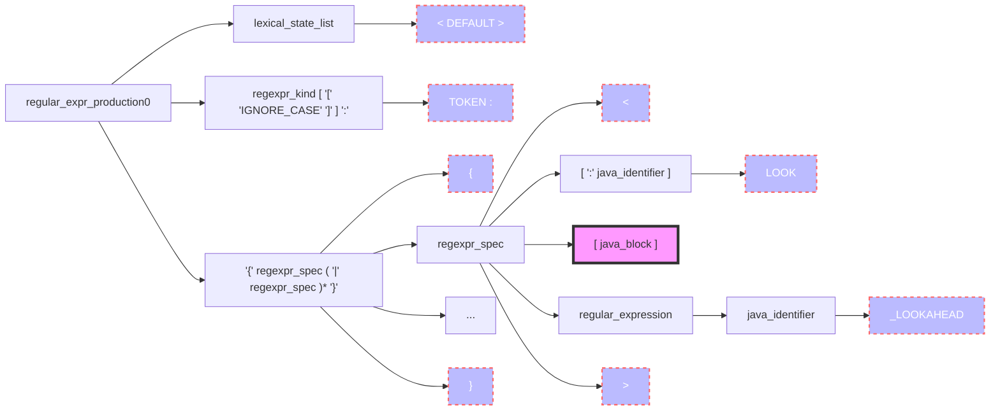
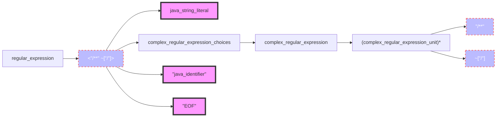
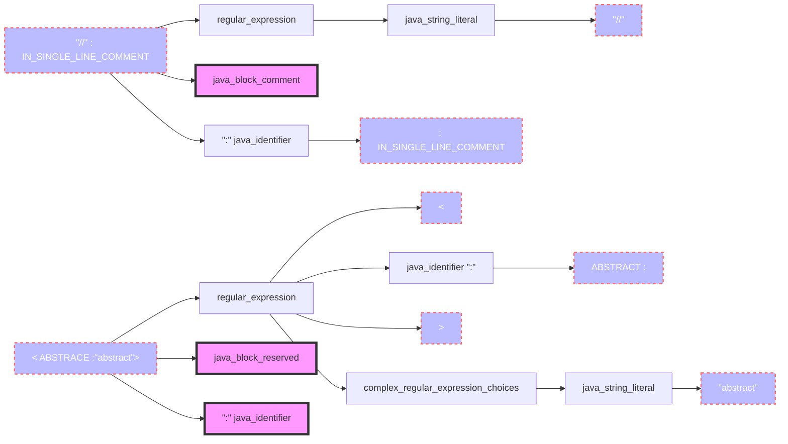
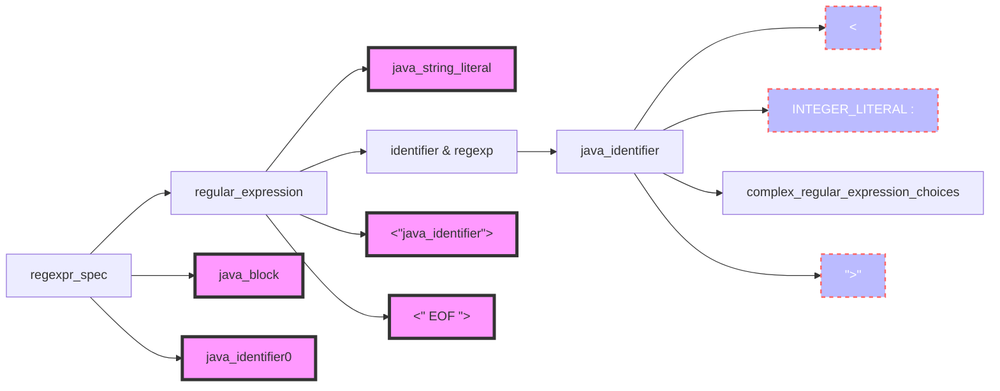
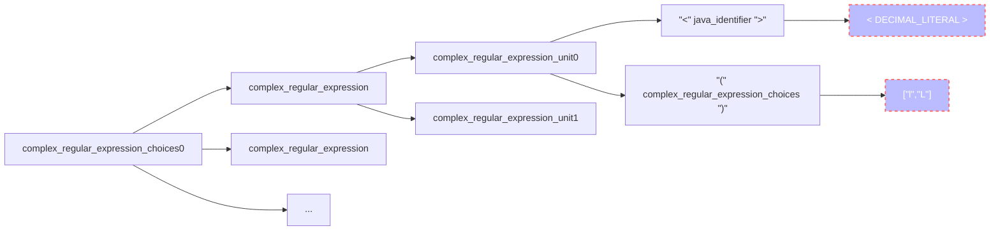
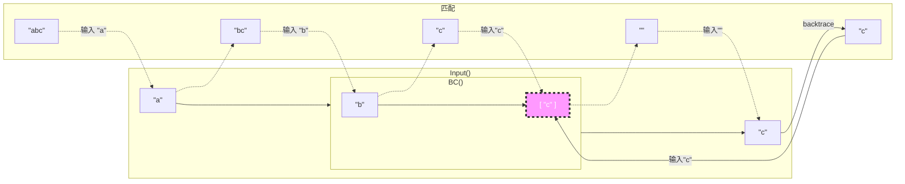
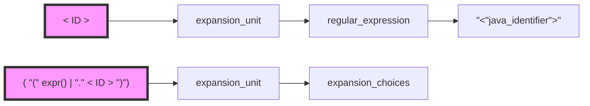

# javacc

## reference

[JavaCC官方文档](https://javacc.github.io/javacc/)

[Token Manager](https://javacc.github.io/javacc/tutorials/token-manager.html)

[lookahead](https://javacc.github.io/javacc/tutorials/lookahead.html)

[error handling](https://javacc.github.io/javacc/tutorials/error-handling.html)

[lexer tips](https://javacc.github.io/javacc/tutorials/lexer-tips.html)

[JavaCC documentation](https://javacc.github.io/javacc/documentation/)

[JavaCC tutorials](https://javacc.github.io/javacc/tutorials/)

[JavaCC tutorials PDF](https://www.engr.mun.ca/~theo/JavaCC-Tutorial/javacc-tutorial.pdf)

## QA

### javacc内有几种词法状态，分别有什么用？

javacc 默认有这些常用词法状态：

1. `<DEFAULT>`：默认的词法状态，用于大多数情况下的词法规则。
2. `<SPECIAL_CHARS>`：用于处理特殊字符的词法状态，例如运算符、分隔符等。
3. `<STRING_LITERAL>`：用于处理字符串字面量的词法状态。
4. `<COMMENT>`：用于处理注释的词法状态。
5. `<IDENTIFIER>`：用于处理标识符（identifier）的词法状态。

**同时，我们可以在 Javacc 的语法文件中使用 `TOKEN_MGR_DECLS` 部分来定义词法状态，并在词法规则中使用相应的词法状态。**

### regexpr_kind 和 lexical_state_list 有什么区别？

**lexical_state_list 表示的是词法状态，而 regexpr_kind 表示的 regular_expr_prodution 的返回值。**

`regexpr_kind` 在 javacc 中有四个枚举值：

1. TOKEN 返回一个token，是最常用的类型
2. SPECIAL_TOKEN 返回一个special token，和token不同的是，对于parser来说他没有任何语义，一般用于处理注释之类的特殊文本；
3. SKIP 直接跳过，和SPECIAL_TOKEN不一样的是，他没有返回值；
4. MORE 读取更多的文本，直到匹配到TOKEN或者SPECIAL_TOKEN；

在下面的例子中，我们表示的含义是：在 lexical state 为 DEFAULT 的情况下，当读取到字符串 "MY_INTEGER" 时，返回一个名为 MY_INTEGER 的 TOKEN。

```java
<DEFAULT> TOKEN: {
  MY_INTEGER: "MY_INTEGER"
}
```

### lexical state 是如何变化的

lexical state 的变化是通过 `regexpr_spec` 声明的规则变化的：

```java
regexpr_spec ::= regular_expression [ java_block ] [ ":" java_identifier ]
```

根据文档描述：

Each regular expression specification contains a regular expression followed by a **Java block (the lexical action)** which is optional. This is then followed by an identifier of a **lexical state** (which is also optional).

Whenever this regular expression is matched, the lexical action (if any) gets executed, followed by any common token actions. Then the action depending on the [regular expression production kind](https://javacc.github.io/javacc/documentation/grammar.html#regexpr-kind) is taken. **Finally, if a lexical state is specified, the token manager moves to that lexical state for further processing **(the token manager starts initially in the state `DEFAULT`).

在我们实际的应用中，一般是基于 regular_expr_production 使用：

```java
regular_expr_production ::= [ lexical_state_list ]
                            regexpr_kind [ "[" "IGNORE_CASE" "]" ] ":"
                            "{" regexpr_spec ( "|" regexpr_spec )* "}"
```

在 regular_expr_production 中，我们最后调用了 regexpr_spec，**可能会修改 lexical state**，举个例子：

```java
<DEFAULT> SKIP : { " "
                 | "\t"
                 | "\n"
                 | "\r"
                 | "\f"
                 | "/*@egen*/" : AFTER_EGEN
}
```

 `regular_expr_production` 表示的含义是：在 lexical state == DEFAULT 状态下，如果读取到 " ", "\t", "\n", "\r", "\f", "/\*@egen\*/" 中任意一个字符，则直接跳过（由于 `regexpr_kind` 是 SKIP）。如果匹配到的是 `/*@egenn*/` 还会把 lexical state 转换为 `AFTER_EGEN`；

## Javacc介绍

### 如何使用 javacc

#### 最简单的例子

> 查看 `javacc` 模块下，我们有一个最简单的例子。

#### 基于源码编译

```bash
wget https://github.com/javacc/javacc/archive/javacc-7.0.9.tar.gz
tar -xvf javacc-7.0.9.tar.gz
cd javacc-javacc-7.0.9

# 编译源码
ant
chmod 755 ./scripts/javacc

./scripts/javacc 
# Java Compiler Compiler Version 7.0.9 (Parser Generator)

# 添加javacc到环境变量，随后我们可以使用
javacc braces.jj
```

#### 基于maven插件

> [JavaCC Maven Plugin](https://www.mojohaus.org/javacc-maven-plugin/#usage.html)

在maven文件中引入 javacc plugin，如下配置

```xml
<?xml version="1.0" encoding="UTF-8"?>
<project xmlns="http://maven.apache.org/POM/4.0.0"
         xmlns:xsi="http://www.w3.org/2001/XMLSchema-instance"
         xsi:schemaLocation="http://maven.apache.org/POM/4.0.0 http://maven.apache.org/xsd/maven-4.0.0.xsd">
    <parent>
        <artifactId>test-calcite</artifactId>
        <groupId>com.xxx.calcite</groupId>
        <version>1.0</version>
    </parent>
    <modelVersion>4.0.0</modelVersion>

    <artifactId>test-javacc</artifactId>

    <dependencies>
    </dependencies>

    <build>
        <resources>
            <resource>
                <directory>${basedir}/src/main/resources</directory>
            </resource>
        </resources>

        <!-- find and add *.jj then generate code -->
        <plugins>
            <plugin>
                <groupId>org.codehaus.mojo</groupId>
                <artifactId>javacc-maven-plugin</artifactId>
                <version>3.0.0</version>
                <executions>
                    <execution>
                        <phase>generate-sources</phase>
                        <id>javacc</id>
                        <goals>
                            <goal>javacc</goal>
                        </goals>
                        <configuration>
                            <sourceDirectory>${basedir}/src/main/javacc</sourceDirectory>
                            <includes>
                                <include>**/*.jj</include>
                            </includes>
                            <lookAhead>2</lookAhead>
                            <isStatic>false</isStatic>
                            <outputDirectory>${basedir}/generated-sources/</outputDirectory>
                        </configuration>
                    </execution>
                </executions>
            </plugin>

            <!-- add generated sources code to classpath -->
            <plugin>
                <groupId>org.codehaus.mojo</groupId>
                <artifactId>build-helper-maven-plugin</artifactId>
                <version>3.4.0</version>
                <executions>
                    <execution>
                        <id>add-source</id>
                        <phase>generate-sources</phase>
                        <goals>
                            <goal>add-source</goal>
                        </goals>
                        <configuration>
                            <sources>
                                <source>${basedir}/src/main/java/</source>
                                <source>${basedir}/generated-sources/</source>
                            </sources>
                        </configuration>
                    </execution>
                </executions>
            </plugin>

            <!-- clean generated sources when run command 'mvn clean' -->
            <plugin>
                <artifactId>maven-clean-plugin</artifactId>
                <version>2.4.1</version>
                <configuration>
                    <filesets>
                        <fileset>
                            <directory>${basedir}/generated-sources</directory>
                            <includes>
                                <include>**/*</include>
                            </includes>
                            <followSymlinks>false</followSymlinks>
                        </fileset>
                    </filesets>
                </configuration>
            </plugin>
        </plugins>

    </build>
</project>
```

这里我们指定了sourceDirectory在 `src/main/javacc` 下，我们只需要把需要编译的javacc放在这个目录下。随后执行

```bash
mvn org.codehaus.mojo:javacc-maven-plugin:2.6:javacc
```

编译的文件会存放在目录 `target/generated-sources/javacc` 下

### 一个简单的例子

> 一个用于匹配括号的简单 javacc 源码；
>
> 程序分为三个部分：
>
> 1. 由 `PARSER_BEGIN(Example)` 开始 `PARSER_END(Example)` 结束的 Example 模块，模块是纯java代码，仅仅包含一个main函数。函数内初始化了一个实例，并且调用实际的 parser 逻辑；
> 2. `Input()` 函数， Input() 表示输入应该匹配 MatchedBraces()，后跟着零个或者多个换行，随后是EOF；
> 3. `MatchedBraces()` 函数使用了递归，表示 "{" 和 "}" 之间继续可以存在 MatchedBraces()。
>
> | 输入 | 描述    |
> | ---- | ------- |
> | {}   | valid   |
> | {{}} | valid   |
> | {}{} | invalid |

```java
PARSER_BEGIN(Example)

/** Simple brace matcher. */
public class Example {

  /** Main entry point. */
  public static void main(String args[]) throws ParseException {
    Example parser = new Example(System.in);
    parser.Input();
  }

}

PARSER_END(Example)

/** Root production. */
void Input() :
{}
{
  MatchedBraces() ("\n"|"\r")* <EOF>
}

/** Brace matching production. */
void MatchedBraces() :
{}
{
  "{" [ MatchedBraces() ] "}"
}
```

## [JavaCC Grammer](https://javacc.github.io/javacc/documentation/grammar.html)

### File structure

>The name that follows `PARSER_BEGIN` and `PARSER_END` must be the same and this identifies the name of the generated parser. For example, if name is `MyParser`, then the following files are generated:
>
>- `MyParser.java` - The generated parser.
>- `MyParserTokenManager.java` - The generated token manager (or scanner/lexical analyzer).
>- `MyParserConstants.java` - A bunch of useful constants.
>
>以我们前面的例子 `Example` 为例子，我们最终会生成：
>
>- Example.java
>- ExampleTokenManager.java
>- ExampleConstants.java
>
>Other files such as `Token.java`, `ParseException.java` etc are also generated.

```java
javacc_input ::= javacc_options
                 "PARSER_BEGIN" "(" <IDENTIFIER> ")"
                 java_compilation_unit
                 "PARSER_END" "(" <IDENTIFIER> ")"
                 ( production )+
                 <EOF>
  
javacc_options ::= [ "options" "{" ( option-binding )*; "}" ]

production ::= javacode_production
             | regular_expr_production
             | bnf_production
             | token_manager_decls 
```

> `java_compilation_unit`'s name must same as the name of the `<IDENTIFIER>`

```java
PARSER_BEGIN(parser_name)

class parser_name ... {
  // ...
}

PARSER_END(parser_name)
```

> If the compilation unit includes a package declaration, this is included in all the generated files.

```java
// 在下面的这个javacc文件中，所有的生成文件都会在 com.xx.generated 包下
PARSER_BEGIN(Example)

package com.xxx.generated;

/** Simple brace matcher. */
public class Example {

  /** Main entry point. */
  public static void main(String args[]) throws ParseException {
    Example parser = new Example(System.in);
    parser.Input();
  }

}

PARSER_END(Example)
```

### Grammar

#### production

```java
production ::= javacode_production
             | regular_expr_production
             | bnf_production
             | token_manager_decls
```

- [javacode_production](https://javacc.github.io/javacc/documentation/grammar.html#javacode-production) and [bnf_production](https://javacc.github.io/javacc/documentation/grammar.html#bnf-production) are used to define the grammar from which the parser is generated.（java_code_production 和 bnf_production 用于定义生成解析器的语法）
- [regular_expr_production](https://javacc.github.io/javacc/documentation/grammar.html#regular-expr-production) is used to define the grammar tokens - the token manager is generated from this information (as well as from inline token specifications in the parser grammar).

- [token_manager_decls](https://javacc.github.io/javacc/documentation/grammar.html#token-manager-decls) is used to introduce declarations that get inserted into the generated token manager.

#### javacode_production

> `javacode_production` 就是前面跟着一个固定前缀 `JAVACODE`，后面完全是一个常规的 `java函数`。

```java
javacode_production ::= "JAVACODE"
                        java_access_modifier java_return_type java_identifier "(" java_parameter_list ")"
                        java_block
```

> 我们下面给到的实例，可以在读到左括号的时候调用，随后一直读取token，直到读到匹配的右括号。
>
> 1. java_access_modifier 可以被省略；
> 2. java_parameter_list 可能没有任何参数；

```java
JAVACODE
void skip_to_matching_brace() {
  Token tok;
  int nesting = 1;
  while (true) {
    tok = getToken(1);
    if (tok.kind == LBRACE) nesting++;
    if (tok.kind == RBRACE) {
      nesting--;
      if (nesting == 0) break;
    }
    tok = getNextToken();
  }
}
```

`JAVACODE`  有一个问题就是，当面临 **choice points** 时，他对于javacc来说是个黑盒，我们可以看下面这个例子，javacc在编译过程中会无法确定到底应该进入哪个模块；

```java
void NT() : {}
{
  skip_to_matching_brace()
    |
  some_other_java_production()
}
```

但是，当我们的函数是 **non-choice point** 时，它是合法的，换句话说，我们可以通过某种方式来提示javacc到底应该选择哪个 JAVACODE，在下面这种情况下，当javacc进入到 `NT()` 时，我们可以通过下一个token来判断具体应该选择的模块。

```java
void NT() : {}
{
  "{" skip_to_matching_brace() "}"
    |
  "(" some_other_java_production() ")"
}
```

JAVACODE 的 **choice points** 也可以在句法或者语义 `LOOKAHEAD` 之前：

```java
void NT() : {}
{
  LOOKAHEAD ({errorOccurred}) skip_to_matching_brace()
    |
  "(" parameter_list() ")"
}
```

#### bnf_production

bnf_production 和 javacode_production 类似，区别在于：

1. javacode_production 有一个固定的前缀 JAVACODE；
2. bnf_production 的 java参数列表和java代码块中间会多一个额外的 `:`；
3. bnf_production 最后会紧跟 "{" expansion_choices "}"；

```java
javacode_production ::= "JAVACODE"
                        java_access_modifier java_return_type java_identifier "(" java_parameter_list ")"
                        java_block

bnf_production ::= java_access_modifier java_return_type java_identifier "(" java_parameter_list ")" ":"
                   java_block
                   "{" expansion_choices "}"
```

#### regular_expr_production

> regular_expr_production 从它所适用的词法状态（lexical state）规范作为开头，紧跟着一个关于 regular_expr_production 到底是什么的描述，随后是一个可选的 `[IGNORE_CASE]`
>
> - `lexical_state_list` 描述了 `regular_expr_production` 匹配的词法状态；
> - `regexpr_kind` 描述了 `regular_expr_production` 的具体类型；

```java
regular_expr_production ::= [ lexical_state_list ]
                            regexpr_kind [ "[" "IGNORE_CASE" "]" ] ":"
                            "{" regexpr_spec ( "|" regexpr_spec )* "}"
```

`regular_expr_production` 一般用于定义被生成的token manager处理的词汇实体（lexical entities）。

#### token_manager_decls

```java
token_manager_decls ::= "TOKEN_MGR_DECLS" ":" ClassOrInterfaceBody
```

#### lexical_state_list

> 1. `lexical_state_list` 是 `regular_expr_production` 的开头，他是可选项。
> 2. lexical state list 描述了对应的 `regular_expr_production` 适用的词法状态。
> 3. `<*>` 表示匹配所有状态。
> 4. 否则匹配所有声明的 java_identifier。

```java
lexical_state_list ::= "<" "*" ">"
                     | "<" java_identifier ( "," java_identifier )* ">"
```

#### regexpr_kind

> `regexpr_kind`紧跟在 `regular_expr_production`模块的 `lexical_state_list` 声明之后，并且是一个枚举值。

```java
regexpr_kind ::= "TOKEN"
               | "SPECIAL_TOKEN"
               | "SKIP"
               | "MORE"
```

| type          | description                                                 |
| ------------- | ----------------------------------------------------------- |
| TOKEN         | 普通TOKEN                                                   |
| SPECIAL_TOKEN | 特殊TOKEN，表示在parsing阶段无意义的TOKEN，例如注释         |
| SKIP          | 可以直接跳过，一般是换行，空格之类的                        |
| MORE          | 此类型存储在缓冲区中，直到碰到下一个 TOKEN 或 SPECIAL_TOKEN |

#### regexpr_spec

> `regexpr_spec` 是 `regular_expr_production` 的最后部分，在 regular_expr_production 中它是一个列表，他是 regular_expr_production 中 lexical entities 的实际描述。

```java
regexpr_spec ::= regular_expression [ java_block ] [ ":" java_identifier ]
```

#### expansion_choices

> `expansion_choices` 是 `bnf_production` 中最后的那部分，他是一个 expansion 列表；expansion 中任意一个解析合法，则整个 expansion_choices 合法。

```java
expansion_choices ::= expansion ( "|" expansion )*
```

#### expansion

> expansion 是 expansion_unit 的合集，如果从头到尾匹配 expansion units，则 expansion 合法。 
>
> 例如 `{ decls() }` 匹配任意以 `{` 开头， `}` 结尾，中间匹配 `decls()` 的 lexical entities。

```java
expansion	::=	( expansion_unit )*
```

#### expansion_unit

```java
expansion_unit ::= local_lookahead
                 | java_block
                 | "(" expansion_choices ")" [ "+" | "*" | "?" ]
                 | "[" expansion_choices "]"
                 | [ java_assignment_lhs "=" ] regular_expression
                 | [ java_assignment_lhs "=" ] java_identifier "(" java_expression_list ")"
```

> - `local_lookahead` 指示parser在 choice points 如何选择；
> - `"(" expansion_choices ")" [ "+" | "*" | "?" ]` 是和 expansion_choices 的递归，这里表示可能有零个或多个，一个或多个，零个或一个三个选项；
> - `"[" expansion_choices "]"` 等同于 `"(" expansion_choices ")" ?`
> - `[ java_assignment_lhs "=" ] regular_expression` An expansion unit can be a [regular expression](https://javacc.github.io/javacc/documentation/grammar.html#regular-expression). Then a legal parse of the expansion unit is any token that matches this regular expression. When a regular expression is matched, it creates an object of type `Token`. This object can be accessed by assigning it to a variable by prefixing the regular expression with `variable =`. 
> - `[ java_assignment_lhs "=" ] java_identifier "(" java_expression_list ")"` expansion unit 可以是一个非终结符，在这种情况下它采用方法调用的形式，并且可以把这个方法调用赋值给一个 java_assignment_lhs

#### local_lookahead

```java
local_lookahead ::= "LOOKAHEAD" "(" [ java_integer_literal ] [ "," ] [ expansion_choices ] [ "," ] [ "{"    java_expression "}" ] ")"
```

> A local lookahead specification is used to influence the way the generated parser makes choices at the various choice points in the grammar.
>
> - `java_integer_literal`  a lookahead limit (the integer literal)
> - `exansion_choices` a syntactic lookahead
> - `"{" java_expression "}"` a semantic lookahead 

#### regular_expression

>A regular expression `"<" [ [ "#" ] java_identifier ":" ] complex_regular_expression_choices ">"` may also be a more [complex regular expression](https://javacc.github.io/javacc/documentation/grammar.html#complex-regular-expression) using which more involved regular expression (than string literals can be defined). Such a regular expression is placed within angular brackets `<...>`, and may be labeled optionally with an identifier. **This label may be used to refer to this regular expression from [expansion units](https://javacc.github.io/javacc/documentation/grammar.html#expansion-unit) or from within other regular expressions**. If the label is preceded by a `#`, then this regular expression may not be referred to from expansion units, but only from within other regular expressions. When the `#` is present, the regular expression is referred to as a *private regular expression*.

```java
regular_expression ::= java_string_literal
                     | "<" [ [ "#" ] java_identifier ":" ] complex_regular_expression_choices ">"
                     | "<" java_identifier ">"
                     | "<" "EOF" ">"
```

```java
// 这是一个 regular_expr_production 的例子，这个例子中，省略了 lexical_state_list 部分
// 在 "{" 和 "}" 内，用 "|" 分隔的是两个 regexpr_spec
// regexpr_spec ::= regular_expression [ java_block ] [ ":" java_identifier ]
// 这里 regexpr_spec 的两个可选项都没有声明
// 也就是他们对应的是 regular_expression
// 随后可以看到，他们都对应于 regular_expression 中的这个部分
// "<" [ [ "#" ] java_identifier ":" ] complex_regular_expression_choices ">"
// 第一个声明了一个名为 FLOATING_POINT_LITERAL 的 java_identifier
// 第二个声明了一个名为 EXPONENT 的 java_identifier
// ":" 之后紧跟的就是 complex_regular_expression_choices
// 而第二个 complex_regular_expression_choices 中的 "#" 表示这是一个私有的变量
TOKEN : {
  < FLOATING_POINT_LITERAL:
      (["0"-"9"])+ "." (["0"-"9"])* (<EXPONENT>)? (["f","F","d","D"])?
    | "." (["0"-"9"])+ (<EXPONENT>)? (["f","F","d","D"])?
    | (["0"-"9"])+ <EXPONENT> (["f","F","d","D"])?
    | (["0"-"9"])+ (<EXPONENT>)? ["f","F","d","D"]
  >
  |
  < #EXPONENT: ["e","E"] (["+","-"])? (["0"-"9"])+ >
}
```

**If the `#` is omitted, the token manager will erroneously recognize a string like E123 as a legal token of kind `EXPONENT` (instead of `IDENTIFIER` in the Java grammar).**

#### complex_regular_expression_choices

```java
complex_regular_expression_choices ::= complex_regular_expression ( "|" complex_regular_expression )*
```

#### complex_regular_expression

```java
complex_regular_expression ::= ( complex_regular_expression_unit )*
```

#### complex_regular_expression_unit

```java
complex_regular_expression_unit ::= java_string_literal
                                  | "<" java_identifier ">"
                                  | character_list
                                  | "(" complex_regular_expression_choices ")" [ "+" | "*" | "?" ]
```

#### character_list

```java
character_list ::= [ "~" ] "[" [ character_descriptor ( "," character_descriptor )* ] "]"
```

#### character_descriptor

```java
character_descriptor ::= java_string_literal [ "-" java_string_literal ]
```

## [JavaCC BNF](https://javacc.github.io/javacc/documentation/bnf.html)

### Tokens

#### Reserved words



> 以下代码的意思是：在 `lexical state` == `DEFAULT` 的状态下：
>
> 1. 如果读取到字符串 "LOOKAHEAD" 则返回 TOKEN `_LOOKAHEAD`；
> 2. 如果读取到字符串 "IGNORE_CASE" 则返回 TOKEN `_IGNORE_CASE`；
> 3. 以此类推；

```java
/*
 * These are the only tokens in JavaCC but not in Java.
 */
<DEFAULT> TOKEN : { <_LOOKAHEAD: "LOOKAHEAD">
                  | <_IGNORE_CASE: "IGNORE_CASE">
                  | <_PARSER_BEGIN: "PARSER_BEGIN">
                  | <_PARSER_END: "PARSER_END">
                  | <_JAVACODE: "JAVACODE">
                  | <_CPPCODE: "CPPCODE">
                  | <_TOKEN: "TOKEN">
                  | <_SPECIAL_TOKEN: "SPECIAL_TOKEN">
                  | <_MORE: "MORE">
                  | <_SKIP: "SKIP">
                  | <_TOKEN_MGR_DECLS: "TOKEN_MGR_DECLS">
                  | <_EOF: "EOF">
                  | <_DCL_PARSER_BEGIN: "DCL_PARSER_BEGIN">
                  | <_DCL_PARSER_END: "DCL_PARSER_END">
                  | <_INC_PARSER_BEGIN: "INC_PARSER_BEGIN">
                  | <_INC_PARSER_END: "INC_PARSER_END">
                  | <_DEF_PARSER_BEGIN: "DEF_PARSER_BEGIN">
                  | <_DEF_PARSER_END: "DEF_PARSER_END">
}
```

#### Whitespace

```java
/*
 * Whitespace
 */
<DEFAULT> SKIP : { " "
                 | "\t"
                 | "\n"
                 | "\r"
                 | "\f"
                 | "/*@egen*/" : AFTER_EGEN
}

<AFTER_EGEN> SKIP : {
  <~[]> : DEFAULT
}
```

第一个 `regular_expr_production` 表示的含义是：在 lexical state == DEFAULT 状态下，如果读取到 " ", "\t", "\n", "\r", "\f", "/\*@egen\*/" 中任意一个字符，则直接跳过（由于 `regexpr_kind` 是 SKIP）。如果匹配到的是 `/*@egenn*/` 随后 lexical state 转换为 `AFTER_EGEN`；

第二个 `regular_expr_production` 表示的含义是：在 lexical state == AFTER_EGEN 状态下，碰见任何非空字符则 lexical state 转换为 `DEFAULT`；

#### Comments

> 第一个表达式的含义是：在DEFAULT状态下：
>
> 1. 如果读到 "//" 则lexical state转换为IN_SINGLE_LINE_COMMENT
> 2. 如果读到 `<"/**" ~["/"]>`（这是一个 `regular_expression`，状态递归如下图所示。），则lexical state转换为 IN_FORMAL_COMMENT
> 3. 如果读到 "/*" 则lexical state转换为IN_MULTI_LINE_COMMENT
> 4. 如果读到 "/*@bgen(jjtree" 则lexical state转换为IN_MULTI_LINE_COMMENT



这里值得注意的是，`complex_regular_expression` 的词法是一个连续的 `complex_regular_expression_unit`。

```java
complex_regular_expression ::= ( complex_regular_expression_unit )*
```

A complex regular expression is a sequence of complex regular expression units. A match for a complex regular expression **is a concatenation of matches** to the complex regular expression units.

也就是说，我们先匹配 `/**` 匹配完之后再匹配 `~["/"]`，也就是任何非 / 字符，并且由于lexical state状态是MORE，会一直连续的去匹配，直到碰到第一个 `/`。

```java
/*
 * Comments
 */
<DEFAULT> MORE : { "//" : IN_SINGLE_LINE_COMMENT
                 | <"/**" ~["/"]> : IN_FORMAL_COMMENT
                 | "/*" : IN_MULTI_LINE_COMMENT
                 | "/*@bgen(jjtree" : IN_MULTI_LINE_COMMENT
}

<IN_SINGLE_LINE_COMMENT> SPECIAL : {
  <SINGLE_LINE_COMMENT: "\n" | "\r" | "\r\n"> : DEFAULT
}

<IN_FORMAL_COMMENT> SPECIAL : {
  <FORMAL_COMMENT: "*/"> : DEFAULT
}

<IN_MULTI_LINE_COMMENT> SPECIAL : {
  <MULTI_LINE_COMMENT: "*/"> : DEFAULT
}

<IN_SINGLE_LINE_COMMENT,IN_FORMAL_COMMENT,IN_MULTI_LINE_COMMENT> MORE : {
  <~[]>
}
```

#### Reserved words and literals

这段代码的逻辑比较简单，就是匹配固定字符串后返回对应的TOKEN，但是有一点值得一提的是，他的结构和 `Comments` 例子中并不一样，我们以 `"//" : IN_SINGLE_LINE_COMMENT` 和 `<ABSTRACT: "abstract">` 举例说明。




```java
/*
 * Java reserved words and literals
 */
<DEFAULT> TOKEN : { <ABSTRACT: "abstract">
                  | <ASSERT: "assert">
                  | <BOOLEAN: "boolean">
                  | <BREAK: "break">
                  | <BYTE: "byte">
}
```

#### java string literal

再看一个特殊的TOKEN解析语法，包含了 `private regular expression`。

可以看到，第一部分是一个长表达式

```java
<INTEGER_LITERAL: <DECIMAL_LITERAL> (["l","L"])?
  | <HEX_LITERAL> (["l","L"])?
  | <OCTAL_LITERAL> (["l","L"])?
  | <BINARY_LITERAL> (["l","L"])?>
```

引用层级如下所示：



其中 `complex_regular_expression_choices` 就是一个 `complex_regular_expression` 列表，对应：

1. <DECIMAL_LITERAL> (["l","L"])?
2. <HEX_LITERAL> (["l","L"])?
3. <OCTAL_LITERAL> (["l","L"])?
4. <BINARY_LITERAL> (["l","L"])?

其中引用了内部定义的 regexp，引用层级如下所示：




```java
/*
 * Java literals
 */
<DEFAULT> TOKEN : {
  <INTEGER_LITERAL: <DECIMAL_LITERAL> (["l","L"])?
  	| <HEX_LITERAL> (["l","L"])?
  	| <OCTAL_LITERAL> (["l","L"])?
  	| <BINARY_LITERAL> (["l","L"])?>
  | <#DECIMAL_LITERAL: ["1"-"9"] (("_")* ["0"-"9"])*>
  | <#HEX_LITERAL: "0" ["x","X"] ["0"-"9","a"-"f","A"-"F"] (("_")* ["0"-"9","a"-"f","A"-"F"])*>
  | <#OCTAL_LITERAL: "0" (("_")* ["0"-"7"])*>
  | <#BINARY_LITERAL: "0" ["b","B"] ["0","1"] (("_")* ["0","1"])*>
}
```

### Non-Terminals

#### Java Grammar

## [JavaCC tutorial](https://javacc.github.io/javacc/tutorials/)

### [JavaCC Token Manager](https://javacc.github.io/javacc/tutorials/token-manager.html)

#### Lexical States

javacc的语法规范被组织为一个 `lexical state` 的集合并且每一个都有一个唯一的名字，默认为 `DEFAULT`。

#### Lexical Actions

声明 `regular_expr_production` 的语法中，有一个用于 regular expression 匹配的模块是 `regexpr_spec`。

当正则匹配成功的时候，`java_block`，也就是我们这里提到的 Lexical Actions 开始执行，所有在 `TOKEN_MGR_DECLS` 定义的 variables 和 methods 都可以调用，同时在后文提到的方法也可以调用。

```java
regular_expr_production ::= [ lexical_state_list ]
                            regexpr_kind [ "[" "IGNORE_CASE" "]" ] ":"
                            "{" regexpr_spec ( "|" regexpr_spec )* "}"
  
regexpr_spec ::= regular_expression [ java_block ] [ ":" java_identifier ]
```

##### Variables within lexical actions

下面的变量在 lexical action 中可用，image是一个 StringBuffer 变量，包含了最后一个 lexical state（可能是 TOKEN，SKIP，SPECIAL_TOKEN 中的任意一个）匹配的所有char。

如果当前的lexical state是 MORE，我们对image做的变更会传递到子匹配中。

image 的内容不会自动的赋值到匹配token，如果我们想要想要实现这个效果，就必须显式的对它进行赋值（在TOKEN或SPECIAL_TOKEN的匹配中）。

```java
// 可读/可写
StringBuffer image
```

###### Example1

> 在下面的例子中，我们 S2 可以有两种不同的定义
>
> ```java
> <S2> TOKEN : {
>     < ABCD: "cd" >
>     { System.out.println(image); } : DEFAULT
> }
> ```
>
> 和
>
> ```java
> <S2> TOKEN : {
>     "cd"
>     { System.out.println(image); } : DEFAULT
> }
> ```
>
> 第一种识别到token并绑定到ABCD上，第二种识别到一个匿名token。

```java
options {

}

PARSER_BEGIN(MyLexical)

package com.xxx.generated.lexical;

public class MyLexical {

}

PARSER_END(MyLexical)

<DEFAULT> MORE : {
    "a" : S1
}

<S1> MORE : {
    "b" {
        int l = image.length()-1; image.setCharAt(l, Character.toUpperCase(image.charAt(l)));
    } : S2
}

<S2> TOKEN : {
    < ABCD: "cd" >
    { System.out.println(image); } : DEFAULT
}
```

```java
package com.xxx;

import com.xxx.generated.ParseException;
import com.xxx.generated.lexical.MyLexical;
import com.xxx.generated.lexical.MyLexicalConstants;
import com.xxx.generated.lexical.Token;

import java.io.StringReader;

public class Application {
    public static void main(String[] args) throws ParseException {
        // 输入源
        String input = "abcd";

        // 创建词法分析器实例
        MyLexical lexer = new MyLexical(new StringReader(input));

        // 获取并处理词法单元
        Token token;
        while ((token = lexer.getNextToken()) != null) {
            if (token.kind == MyLexicalConstants.ABCD) {
                // 在识别到 "cd" 时返回 image
                System.out.println(token.image);
            }
        }
    }
}
```

> 最终输出是
>
> ```java
> // 这个是在语法解析阶段输出的
> aBcd
> // 在程序阶段输出
> abcd
> ```

###### Example2

```java
<DEFAULT> MORE : {
    "a" : S1
}

<S1> MORE : {
    "b" {
        // 1
        int l = image.length()-1;
        image.setCharAt(l, Character.toUpperCase(image.charAt(l)));
        // 2
    } : S2
}

<S2> TOKEN : {
    < ABCD: "cd" >
    {
        // 3
    } : DEFAULT
}
```

将 1,2,3 三个位置修改为如下代码：

```java
System.out.printf("lengthOfMatch = %d\n", lengthOfMatch);
// At ^1: 1 (the size of "b")
// At ^2: 1 (does not change due to lexical actions)
// At ^3: 2 (the size of "cd")
```

还有很多其他变量和方法，一般都在 `MyLexicalTokenManager` 中，例如

```java
// This is the index of the current lexical state. You should not modify this variable. Integer constants whose names are those of the lexical state are generated into the ...Constants file, so you can refer to lexical states without worrying about their actual index value.
int curLexState = 0;

protected SimpleCharStream  input_stream;

protected int curChar;
```

代码也会生成在一个方法下，所以我们也可以调用这个方法的入参，例如：

```java
void TokenLexicalActions(Token matchedToken)
{
   switch(jjmatchedKind)
   {
      case 3 :
        image.append(input_stream.GetSuffix(jjimageLen + (lengthOfMatch = jjmatchedPos + 1)));
        // 3
        System.out.println(matchedToken);
         break;
      default :
         break;
   }
}
```

###### Example3

> 由于我们匹配的Token会生成一个类 `Token.java`，所以其实我们可以在对应的位置去对我们的返回值进行修改；

```java
/* Generated By:JavaCC: Do not edit this line. Token.java Version 7.0 */
/* JavaCCOptions:TOKEN_EXTENDS=,KEEP_LINE_COLUMN=true,SUPPORT_CLASS_VISIBILITY_PUBLIC=true */
package com.xxx.generated.lexical;

/**
 * Describes the input token stream.
 */

public class Token implements java.io.Serializable {

  /**
   * The version identifier for this Serializable class.
   * Increment only if the <i>serialized</i> form of the
   * class changes.
   */
  private static final long serialVersionUID = 1L;

  /**
   * An integer that describes the kind of this token.  This numbering
   * system is determined by JavaCCParser, and a table of these numbers is
   * stored in the file ...Constants.java.
   */
  public int kind;

  /** The line number of the first character of this Token. */
  public int beginLine;
  /** The column number of the first character of this Token. */
  public int beginColumn;
  /** The line number of the last character of this Token. */
  public int endLine;
  /** The column number of the last character of this Token. */
  public int endColumn;

  /**
   * The string image of the token.
   */
  public String image;

  /**
   * A reference to the next regular (non-special) token from the input
   * stream.  If this is the last token from the input stream, or if the
   * token manager has not read tokens beyond this one, this field is
   * set to null.  This is true only if this token is also a regular
   * token.  Otherwise, see below for a description of the contents of
   * this field.
   */
  public Token next;

  /**
   * This field is used to access special tokens that occur prior to this
   * token, but after the immediately preceding regular (non-special) token.
   * If there are no such special tokens, this field is set to null.
   * When there are more than one such special token, this field refers
   * to the last of these special tokens, which in turn refers to the next
   * previous special token through its specialToken field, and so on
   * until the first special token (whose specialToken field is null).
   * The next fields of special tokens refer to other special tokens that
   * immediately follow it (without an intervening regular token).  If there
   * is no such token, this field is null.
   */
  public Token specialToken;


}
/* JavaCC - OriginalChecksum=012c4c12f31a139652da6f726f66a317 (do not edit this line) */
```

我们可以修改我们的匹配结果：

```java
<S2> TOKEN : {
    < ABCD: "cd" >
    {
        // 3
        matchedToken.image = image.toString();
    } : DEFAULT
}
```

这样我们的返回值会变成

```
aBcd
```

##### Access to class level declarations within lexical actions

> Lexical actions have access to a set of class level declarations. These declarations are introduced within the JavaCC file using the following syntax:

```java
token_manager_decls ::=
  "TOKEN_MGR_DECLS" ":"
  "{" java_declarations_and_code "}"
```

These declarations are accessible from all lexical actions.

###### Example6

```java
TOKEN_MGR_DECLS :
{
  int stringSize;
}

// 当匹配到 " 时，初始化 stringSize = 0，并且 lexical state 进入WithinString状态
MORE :
{
  "\"" {stringSize = 0;} : WithinString
}

// 在这里我们注意到一个问题，当碰到 <~ ["\"", "\n", "\r"]> 字符时，下面两个模块都可以匹配
// 按照javacc的词法规定
// All regular expressions in the current lexical state are considered as potential match candidates. 
// The token manager consumes the maximum number of characters from the input stream possible that match one of these regular expressions. 
// That is, the token manager prefers the longest possible match. 
// If there are multiple longest matches of the same length, the regular expression that is matched is the one with the earliest order of occurrence in the grammar file.
// 当我们匹配空字符串 "" 时，两个长度一样，选择先出现的
// 当我们匹配正常字符串时，下面的匹配长度更长，我们选择后出现的
// 但是这里很显然的一个问题是，没有办法匹配 "" 内的 \\\" 字符 
<WithinString> TOKEN :
{
  <STRLIT: "\""> {System.out.println("Size = " + stringSize);} : DEFAULT
}

<WithinString> MORE :
{
  <~["\n","\r"]> {stringSize++;}
}
```

#### Special Tokens

```java
SPECIAL_TOKEN :
{
  <SINGLE_LINE_COMMENT: "//" (~["\n","\r"])* ("\n"|"\r"|"\r\n")>
}
```

SpecialToken 在 `Token.java` 中有个单独的变量：

```java
public Token specialToken;
```

### Lookahead

#### What is lookahead

##### Example1

```java
void Input() :
{}
{
  "a" BC() "c"
}

void BC() :
{}
{
  "b" [ "c" ]
}
```

给定以上 javacc 语法，明显以下两个字符匹配语法，但是假设输入是 `abc`，我们思考一下匹配流程：

1. 匹配字符 "a"；
2. 进入 BC()，匹配字符 "b"；
3. 在BC()中，匹配字符"c"；
4. 回到Input()，匹配"c"失败；
5. 回退到BC()，不匹配字符 "c"；
6. 回到Input()，匹配字符 "c"；

可以看到，我们在 BC() 中匹配 `[ "c" ]` 这一步中，我们面临多个选择，也就是我们所说的 `choice points`。

```
abc
abcc
```

我们可以画图表示我们的整个流程：




##### Avoiding backtracking

编译器在 `choice points` 会通过一些特殊的方式去判断具体的选择，javacc 是通过 **some exploration of tokens further ahead in the input stream** 来决定。这种通过查看输入流后面的tokens的方式，我们称之为 LOOKAHEAD。

##### Choice points in JavaCC grammars

有四种可能得 choice points：

| expansion               | description |
| ----------------------- | ----------- |
| (expr1 \| epxr2 \| ...) |             |
| (expr)？                |             |
| (expr)*                 |             |
| (expr)+                 |             |

##### Default choice determination algorithm

默认 LOOKAHEAD(1)。

##### Example2

> 对于一下 `bnf_production`，我们匹配三个不同的模块：
>
> 1. <ID> "(" expr() ")"
>    1. 匹配<ID> identifier
>    2. 匹配 (
>    3. 匹配 expr()
>    4. 匹配 )
> 2. "(" expr() ")"
>    1. 匹配 (
>    2. 匹配 epxr()
>    3. 匹配 )
> 3. "new" <ID> identifier
>    1. 匹配 new
>    2. 匹配 <ID> identifier

```java
void basic_expr() :
{}
{
  <ID> "(" expr() ")"	// Choice 1
|
  "(" expr() ")"	// Choice 2
|
  "new" <ID>		// Choice 3
}
```

对应的伪代码是

```java
if (next token is <ID>) {
  // choose Choice 1
} else if (next token is "(") {
  // choose Choice 2
} else if (next token is "new") {
  // choose Choice 3
} else {
  // produce an error message
}
```

上面的代码存在一个问题：选择决定算法是由上到下工作，如果第一个选项满足，后面的条件甚至都不会进入匹配流程。在语法多处可匹配需要使用LOOKAHEAD的位置这会导致匹配异常。

##### Example3

在下面的例子中，如果我们使用上面的这种 top-bottom，并且只读取一个 token 的方式，在第一个token为 <ID> 的情况下，将永远无法进入 choice 4 的匹配流程。因为 `next token is <ID>` 永远为 true。

```java
void basic_expr() :
{}
{
  <ID> "(" expr() ")"	// Choice 1
|
  "(" expr() ")"	// Choice 2
|
  "new" <ID>		// Choice 3
|
  <ID> "." <ID>		// Choice 4
}
```

##### Example4

```java
void identifier_list() :
{}
{
  <ID> ( "," <ID> )*
}
```

如果没有LOOKAHEAD，那么我们匹配的伪代码如下所示：

```java
while (next token is ",") {
  choose the nested expansion (i.e. go into the (...)* construct)
	consume the "," token
	if (next token is <ID>) {
    consume it, otherwise report error
  }
}
```

在这个代码中，我们没有去看 `(...)*` 后面的token来决定。

##### Example5

```java
void funny_list() :
{}
{
  identifier_list() "," <INT>
}

void identifier_list() :
{}
{
  <ID> ( "," <ID> )*
}
```

如果是 Example4 中的模式，那么我们这里会导致一些合法的输入也报错。

#### LOOKAHEAD Specification

> 第一种方式是修改我们的语法。

##### Example6

我们可以通过修改语法实现来避免 `example3` 中出现的问题。例如，在下面的代码中，我们把：

- <ID> "(" expr() ")"
- <ID> "." <ID>

进行了一次合并，这个合并类似于数学方程式里的合并同类型，结果是 `<ID> ("(" expr() ")" | "." <ID>)`，注意，这里的 最外层的 `()` 一定不能省略，这样它们才会被识别为一整个 `expansion`，而 <ID> 和 ( "(" expr() ")" | "." <ID> ) 是这个 expansion 中的 expansion_unit，并且存在如下关系




```java
void basic_expr() :
{}
{
  <ID> ( "(" expr() ")" | "." <ID> )
|
  "(" expr() ")"
|
  "new" <ID>
}
```

**This process of modifying grammars to make them `LL(1)` is called *left factoring*.**

##### Example7

```java
void funny_list() :
{}
{
  <ID> "," ( <ID> "," )* <INT>
}
```

##### Option 2 - Parser hints

在下面的例子中，我们的left-factoring不生效。

```java
void basic_expr() :
{}
{
  { initMethodTables(); } <ID> "(" expr() ")"
|
  "(" expr() ")"
|
  "new" <ID>
|
  { initObjectTables(); } <ID> "." <ID>
}
```

##### Setting a global LOOKAHEAD specification

**Suppose you set the value of this option to `2`. Then the `LOOKAHEAD` algorithm derived from this looks at two tokens** (instead of just one token) before making a choice decision. Hence, in [Example 3](https://javacc.github.io/javacc/tutorials/lookahead.html#example3), `Choice 1` will be taken only if the next two tokens are `<ID>` and `(`, while `Choice 4` will be taken only if the next two tokens are `<ID>` and `.`. Hence, the parser will now work properly for [Example 3](https://javacc.github.io/javacc/tutorials/lookahead.html#example3). Similarly, the problem with [Example 5](https://javacc.github.io/javacc/tutorials/lookahead.html#example5) also goes away since the parser goes into the `(...)*` construct only when the next two tokens are `,` and `<ID>`.

##### Setting a local LOOKAHEAD specification

```java
void basic_expr() :
{}
{
  // setting a local LOOKAHEAD specification
  LOOKAHEAD(2)
  <ID> "(" expr() ")"	// Choice 1
|
  "(" expr() ")"	// Choice 2
|
  "new" <ID>		// Choice 3
|
  <ID> "." <ID>		// Choice 4
}
```

伪代码如下：

```java
if (next 2 tokens are <ID> and "(" ) {
  // choose Choice 1
} else if (next token is "(") {
  // choose Choice 2
} else if (next token is "new") {
  // choose Choice 3
} else if (next token is <ID>) {
  // choose Choice 4
} else {
  // produce an error message
}
```

##### Exampe9

> 相似的，exampe5可以修改如下：
>
> *N.B. The `LOOKAHEAD` specification has to occur inside the `(...)` which is the choice is being made. The translation for this construct is shown below (after the first `<ID>` has been consumed):*

```java
void identifier_list() :
{}
{
  <ID> ( LOOKAHEAD(2) "," <ID> )*
}

// example5
void funny_list() :
{}
{
  identifier_list() "," <INT>
}

// example4
void identifier_list() :
{}
{
  <ID> ( "," <ID> )*
}
```

```java
while (next 2 tokens are "," and <ID>) {
  choose the nested expansion (i.e., go into the (...)* construct)
  consume the "," token
  consume the <ID> token
}
```

##### Examp10

javacc无法验证本地lookahead的正确性，如以下if语句示例所示

```java
void IfStm() :
{}
{
 "if" C() S() [ "else" S() ]
}

void S() :
{}
{
  ...
|
  // S() 中可以嵌套if语句
  IfStm()
}
```

上面这个错误是著名的 `dangling else problem`，假设我们有如下输入

```java
if c1 if c2 s1 else s2
```

`else s2` 可以被绑定到这两个 `if` 语句中的任意一个！标准的解决方法是，绑定到 `if c2` 上，也就是离 else 最近的那个 if statement。

##### Syntactic LOOKAHEAD

存在如下语法

```java
void TypeDeclaration() :
{}
{
  ClassDeclaration()
|
  InterfaceDeclaration()
}
```

在 `syntactic  level`，ClassDeclaration 前面可以有很多的前缀，例如 `abstract`， `public` 等。假设这个前缀超过了极限，此时我们可以通过 `syntatctic lookahead` 解决：

> **In syntactic `LOOKAHEAD`, you specify an expansion to try it out and, if that succeeds, then the following choice is taken.**

```java
void TypeDeclaration() :
{}
{
  LOOKAHEAD(ClassDeclaration())
  ClassDeclaration()
|
  InterfaceDeclaration()
}
```

等同于伪代码：

```java
if (the tokens from the input stream match ClassDeclaration) {
  // choose ClassDeclaration()
} else if (next token matches InterfaceDeclaration) {
  // choose InterfaceDeclaration()
} else {
  // produce an error message
}
```

但是他同样存在一个问题：它会消耗较多的时间和做了许多不必要的检查。在我们的实际应用中，我们的输入在碰到 `class` 时就已经结束，因为 `class abstract` 这种语法是不合法的，所以我们在 lookahead 可以继续优化；

```java
void TypeDeclaration() :
{}
{
  LOOKAHEAD(("public" | "final" | "abstract")* "class")
  ClassDeclaration()
|
  InterfaceDeclaration()
}
```

等同于一下伪代码，这样在代码碰见 class 的时候就会结束。

```java
if (the next set of tokens from the input stream are a sequence of
  "abstract", "final", and "public" followed by a "class") {
  // choose ClassDeclaration()
} else if (next token matches InterfaceDeclaration) {
  // choose InterfaceDeclaration()
} else {
  // produce an error message
}
```

##### Semantic LOOKAHEAD

再回到 Example1：

```java
void Input() :
{}
{
  "a" BC() "c"
}

void BC() :
{}
{
  "b" [ "c" ]
}
```

这个例子有个问题是，在BC()中，每次当我们在 choice points 接收到输入 "c" 时，都会匹配并导致后续的 "c" 无法正常匹配，我们可以通过 Semantic Lookahead 来避免：

```java
void Input() :
{}
{
  "a" BC() "c"
}

void BC() :
{}
{
  "b"
  // 这里，我们绑定了 "c" 到一个新建的 TOKEN C。
  [ LOOKAHEAD( { getToken(1).kind == C && getToken(2).kind != C } )
    <C:"c">
  ]
}
```

等同于伪代码：

```java
if (next token is "c" and following token is not "c") {
  // choose the nested expansion (i.e., go into the [...] construct)
} else {
  // go beyond the [...] construct without entering it.
}
```

另外，LOOKAHEAD 也可以接收 `expansion` 作为参数：

```java
void BC() :
{}
{
  "b"
  [ LOOKAHEAD( "c", { getToken(2).kind != C } )
    <C:"c">
  ]
}
```

##### General structure of LOOKAHEAD

The general structure of a `LOOKAHEAD` specification is:

```java
// general structure of LOOKAHEAD
LOOKAHEAD ( amount, expansion, { boolean_expression } )

// grammer
local_lookahead ::= "LOOKAHEAD" "(" [ java_integer_literal ] [ "," ] [ expansion_choices ] [ "," ] [ "{"    java_expression "}" ] ")"
```

The `amount` specifies the number of tokens to `LOOKAHEAD`, `expansion` specifies the expansion to use to perform syntactic `LOOKAHEAD`, and `boolean_expression` is the expression to use for semantic `LOOKAHEAD`.

At least one of the three entries must be present. If more than one are present, they are separated by commas.

## Error Handling

1. exception 有两种类型： `TokenMgrError` 和 `ParseException`。
1. `TokenMgrError` is a subclass of `Error` while `ParseException` is a subclass of `Exception`.

```java
// 这两个类，在javacc生成的代码中会一并生成
public class ParseException extends Exception {

}

public class TokenMgrError extends Error {
  
}
```

### Shallow error recovery

```java
void Stm() :
{}
{
  IfStm()
|
  WhileStm()
}
```

如果我们希望匹配失败时跳转到下下一个 semicolon，可以这样

```java
void Stm() :
{}
{
  IfStm()
|
  WhileStm()
|
  error_skipto(SEMICOLON)
}
```

```java
JAVACODE
void error_skipto(int kind) {
  ParseException e = generateParseException();  // generate the exception object
  System.out.println(e.toString());  // print the error message
  Token t;
  // consume tokens all the way up to a token of "kind" - use a do-while loop
  // rather than a while because the current token is the one immediately before
  // the erroneous token (in our case the token immediately before what should
  // have been "if"/"while".
  do {
    t = getNextToken();
  }
  while (t.kind != kind);
}
```

### Deep Error Recovery

还是同样的例子：

```java
void Stm() :
{}
{
  IfStm()
|
  WhileStm()
}
```

假设我们的异常是在内层抛出的，例如我们解析进入了 `WhilStm()`，并且在内层解析异常。此时由于我们已经进入了新的 javacc 语句块，我们的 `shallow error recovery` 是没有办法处理这个异常的。例如假设我们期望的语法是：

```java
while (foo) {
  stm;
}
```

我们实际的输入是

```java
while foo {
  stm;
}
```

此时，我们可以通过 `try catch finally` 来捕捉这个异常

```java
void Stm() :
{}
{
  try {
      IfStm()
    |
      WhileStm()
    |
  } catch (ParseException e) {
    error_skipto(SEMICOLON);
  }
}
```

再对比一下 error_skipto 函数，我们其实可以省略掉 `generateParseException()` 的调用，因为 catch 语句块已经为我们提供了异常：

```java
void Stm() :
{}
{
  try {
    (
      IfStm()
    |
      WhileStm()
    )
  }
  catch (ParseException e) {
    System.out.println(e.toString());
    Token t;
    do {
      t = getNextToken();
    } while (t.kind != SEMICOLON);
  }
}
```

## Lexer Tips

> This section presents a few tips for writing good lexical specifications.

### String Literals

#### Using string literals as much as possible

**字符常量由 Deterministic Finite Automata（确定有限状态自动机） 识别，速度比 Non-deterministic Finite Automata（不确定有限状态自动机）快很多。**以下面的例子为例

```java
// DFA
SKIP : { " " | "\t" | "\n"}

// NFA
SKIP : { < ([" ", "\t", "\n"])+ > }
```

### Lexical States

#### Minimize use of lexical states

> Try to minimize the use of lexical states.
>
> When using them, try to move all your complex regular expressions into a single lexical state, leaving others to just recognize simple string literals.

### Other

#### Avoid using IGNORE_CASE selectively

Best practise is to set the `IGNORE_CASE` option at the grammar level. If that is not possible, then try to have it set for *all* regular expressions in a lexical state.


## JavaCC/JJTree Examples

### JavaCC Examples

#### Example1

> The `Example1` parser and others in this directory are designed to take input from standard input. `Example1` recognizes matching braces followed by zero or more line terminators and then an end of file.

```java
//
PARSER_BEGIN(Example1)

public class Example1 {
    public static void main(String[] args) throws ParseException {
        Example1 parser = new Example1(System.in);
        parser.Input();
    }
}
PARSER_END(Example1)

void Input() :
{}
{
    MatchedBraces() ("\r" | "\n")* <EOF>
}


// 根据 bnf_production 的定义
// void MatchedBraces() 中的 MatchedBraces 对应的类型是 java_identifier
// 而 { "{" [ MatchedBraces() ] "}" } 内部，是一个 expansion_unit*
// 而在 expansion_unit 的定义中，可以是
// string_literal 对应 "{" 和 "}"
// [ java_assignment_lhs "=" ] java_identifier "(" java_expression_list ")"
// 对应 MatchedBraces()
void MatchedBraces() :
{}
{
    "{" [ MatchedBraces() ] "}"
}
```

#### Example2

> `Example2.jj` is a minor modification to `Example1.jj` to allow white space characters to be interspersed among the braces such that the following input will now be legal:

```java
//
PARSER_BEGIN(Example2)

public class Example2 {
    public static void main(String[] args) throws ParseException {
        Example2 parser = new Example2(System.in);
        parser.Input();
    }
}
PARSER_END(Example2)

void Input() : {}
{
    MatchedBraces() <EOF>
}

void MatchedBraces() : {}
{
    "{" [ MatchedBraces() ] "}"
}


SKIP : {
    " "
    | "\r"
    | "\n"
    | "\t"
}
```

> - `debug_token_manager` debug TOKEN manager
> - `debug_parser` debug parser

#### Example3

> 在原本的基础上，我们在每次递归的调用中输出了嵌套层级，以下是第一个实现。

```java
//
PARSER_BEGIN(Example3)

public class Example3 {
    public static void main(String[] args) throws ParseException {
        Example3 parser = new Example3(System.in);
        parser.Input();
    }
}
PARSER_END(Example3)

void Input() :
{
    int nested = 0;
}
{
    MatchedBraces(nested) <EOF>
}

void MatchedBraces(int nestedValue) :
{
    System.out.println(nestedValue);
    nestedValue = nestedValue + 1;
}
{
    // 这里的代码不会报错
    "{" [ MatchedBraces(nestedValue) ] "}"
}

SKIP : {
    " "
    | "\r"
    | "\n"
}
```

在这里，我们需要注意几个问题：

1. 在 `bnf_production` 中，第一个 `{}` 对应于 `java_block`，这里可以写java代码，并且内部定义的变量仅在内部可以访问；
2. 第二个 `{}` 对应于 `expansion_choices`，注意，这里有一个非常重要的点，`expansion_unit` 中虽然可以调用 `java_block` **但是javacc中的方法参数是不可变的。**。

```java 
void MatchedBraces(int nestedValue) :
{
  	// 这里不管递归多少次都是0
    System.out.println(nestedValue);
}
{
    "{" [ MatchedBraces(nestedValue++) ] "}"
}
```

> `example3.jj` 统计嵌套层级

```java
//
PARSER_BEGIN(Example3)

public class Example3 {
    public static void main(String[] args) throws ParseException {
        Example3 parser = new Example3(System.in);
        parser.Input();
    }
}
PARSER_END(Example3)

void Input() :
{
    int count;
}
{
    count = MatchedBraces() <EOF>
    {
        System.out.println("The levels of nesting is : " + count);
    }
}


int MatchedBraces() :
{
    int nested = 0;
}
{
    // nested = MatchedBraces()
    // 表示 expansion_unit 中的 [ java_assignment_lhs "=" ] regular_expression 部分
    <LBRACE> [ nested = MatchedBraces() ] <RBRACE>

    // java_block
    {
        return ++nested;
    }
}

SKIP : {
    " "
    | "\r"
    | "\n"
}

TOKEN : {
    <LBRACE: "{">
    | <RBRACE : "}">
}
```


